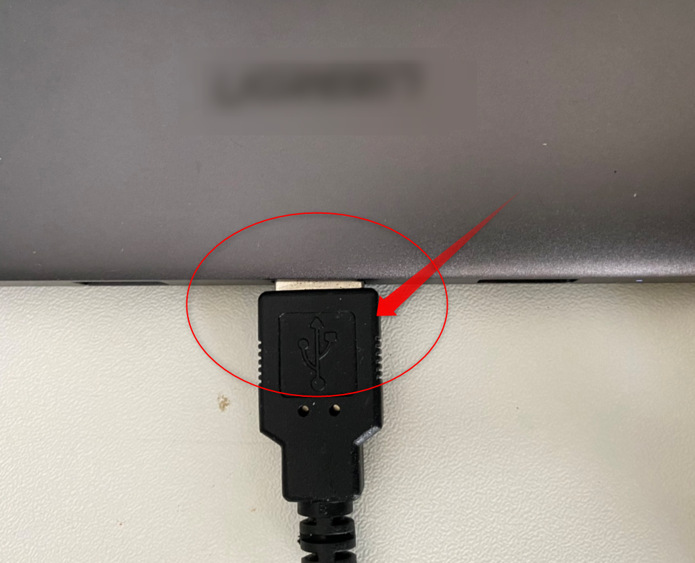
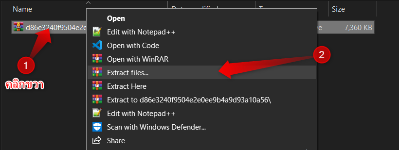
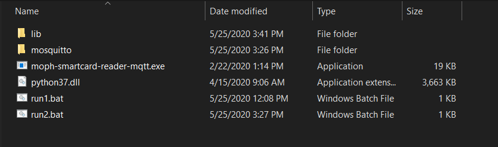
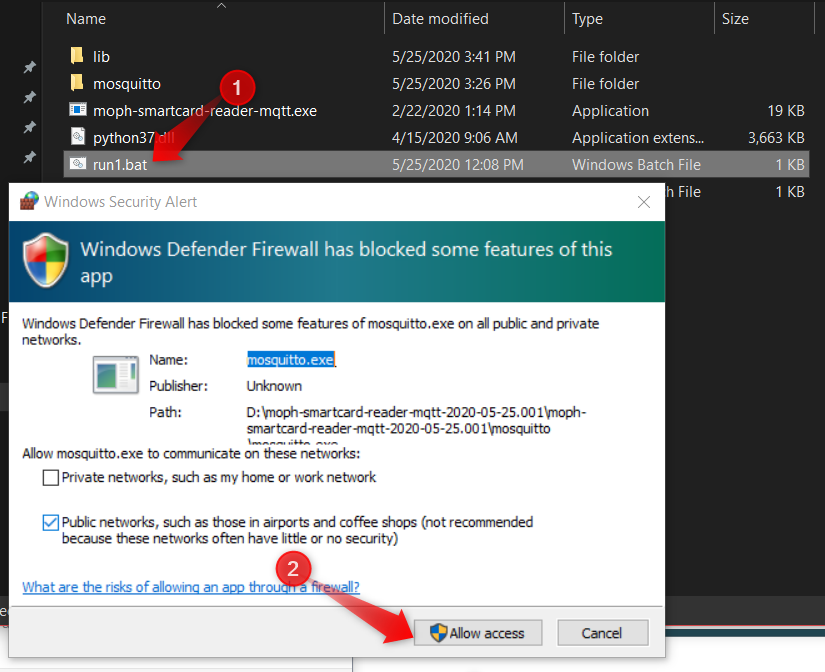
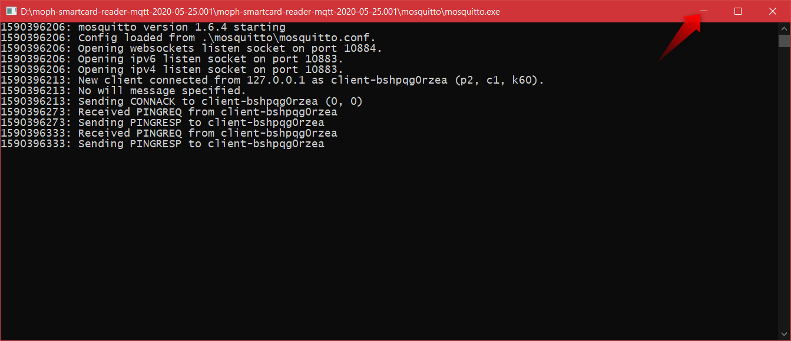
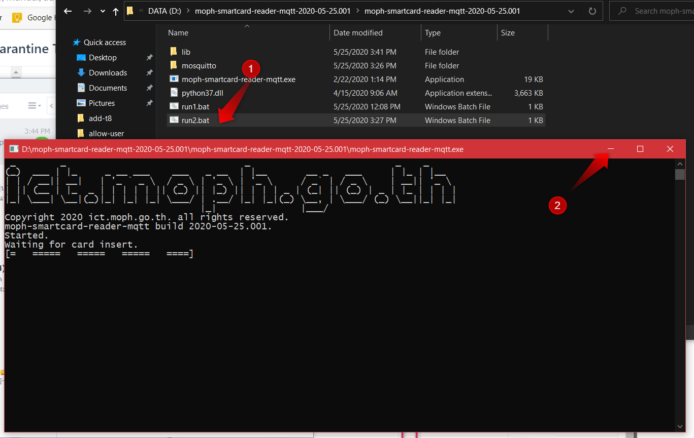
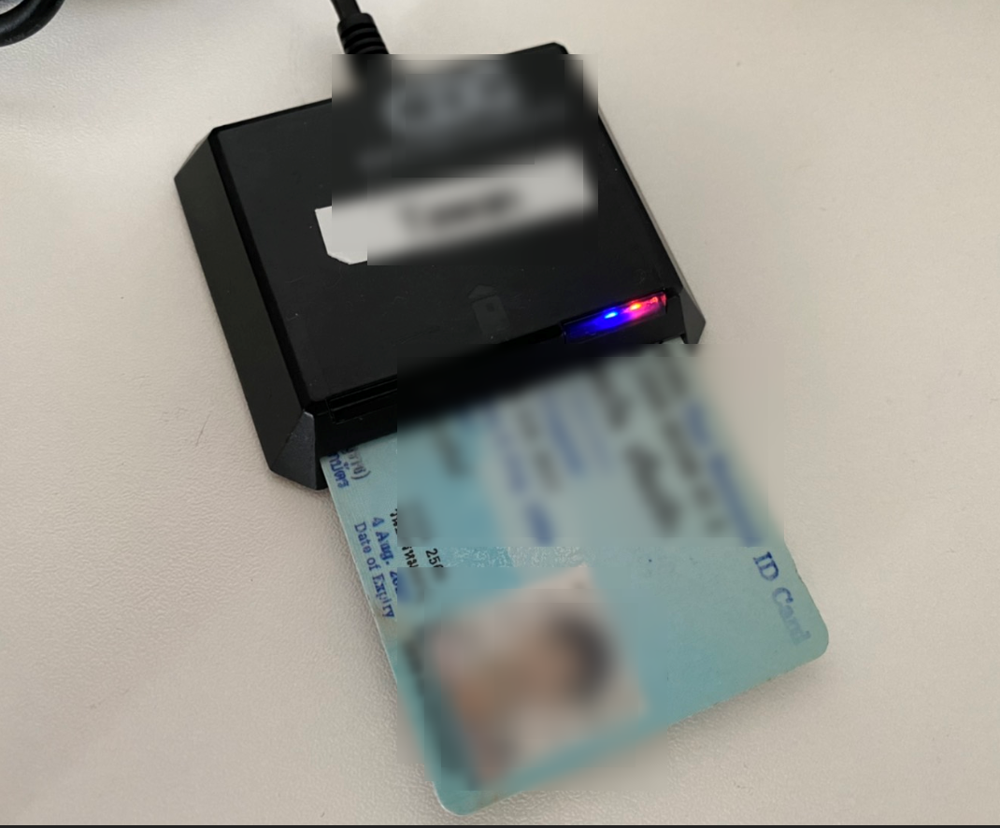
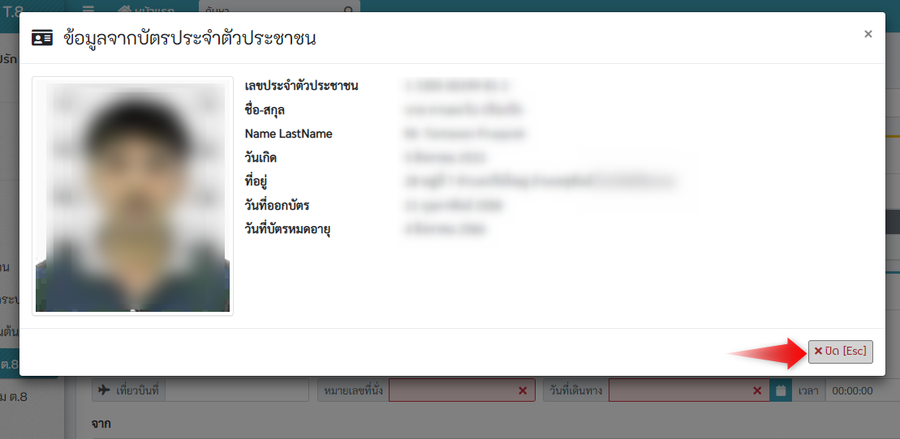
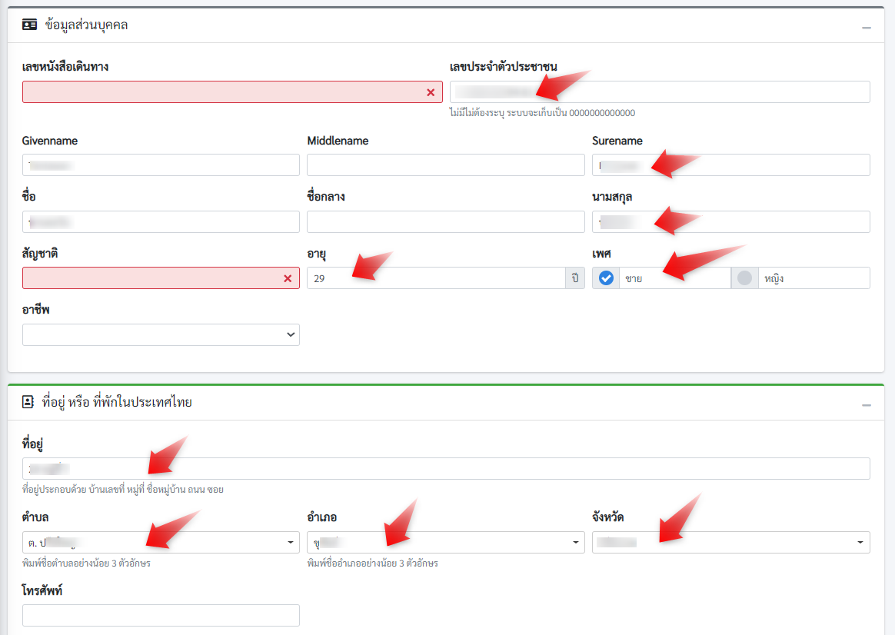

# การติดตั้งเครื่องอ่านบัตรประจำตัวประชาชนแบบ Smartcard

1. เสียบครื่องอ่านบัตร เข้ากับคอมพิวเตอร์

2. ดาวน์โหลดโปรแกรม [moph-smartcard-reader-mqtt-2020-05-25.001](https://smarthealth.moph.go.th/api/download/file/d86e3240f9504e2e0ee9b4a9d93a10a56.zip)

3. เมื่อดาวน์โหลดแล้วให้ทำการ unzip โดย **คลิกขวา** ที่ไฟล์ที่ดาวน์โหลดมา แล้วเลือกเมนู **Extract Files...**

>เมื่อเปิดเข้าไปด้านในของโฟลเดอร์ที่ unzip จะเห็นโฟลเดอร์ **moph-smartcard-reader-mqtt-2020-05-25.001** เมือดับเบิลคลิกเข้าไป จะเห็นไฟล์ดังภาพด้านล่าง

4. เปิดโปรแกรมสำหรับอ่านบัตร
- คลิกที่ **run1.bat** ถ้าใช้งานครั้งแรกจะปรากฏไดอะล็อกแจ้งเตือน Firewall ให้คลิกที่ปุ่ม `Allow access`

  - จะปรากฏหน้าต่างสีดำ ให้คลิก ย่อ หน้าต่างสีดำนี้ไว้ **ห้ามปิด ขณะใช้โปรแกรมอ่านบัตร**
  
- คลิกที่ **run2.bat** จะปรากฏหน้าต่างสีดำ ให้คลิก ย่อ หน้าต่างสีดำนี้ไว้ **ห้ามปิด ขณะใช้โปรแกรมอ่านบัตร**

::: warning
ห้ามปิดหน้าต่างสีดำ ที่เกิดจากการคลิก run1.bat และ run2.bat ขณะใช้โปรแกรมอ่านบัตร
:::

5. คลิกที่ checkbox **ใช้เครื่องอ่านบัตร**
6. เสียบบัตรประจำตัวประชาชนแบบ Smartcard เข้ากับเครื่องอ่านบัตร

7. ระบบจะทำการอ่านข้อมูลจากบัตร และเติมลงในช่องต่างๆ
- เมื่อระบบอ่านข้อมูลสำเร็จจะแสดงไดอะล็อกพร้อมข้อมูล คลิกที่ `ปิด[Esc]`

- ระบบจะเติมข้อมูลที่ได้จากบัตร ลงในช่องข้อมูล

