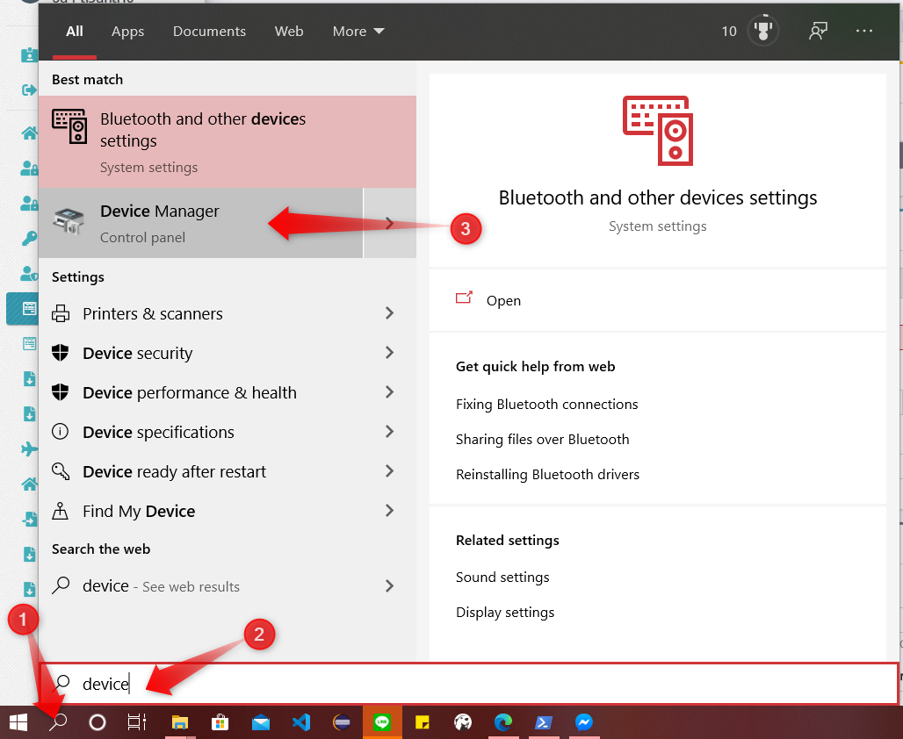
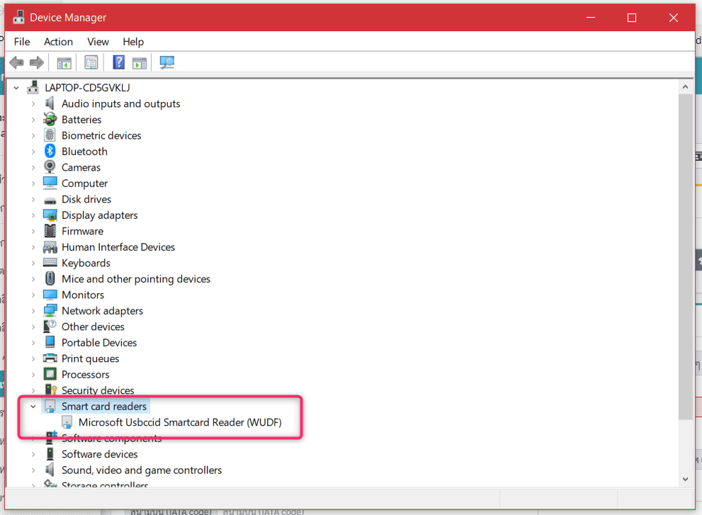
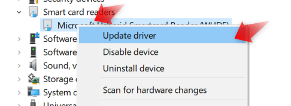
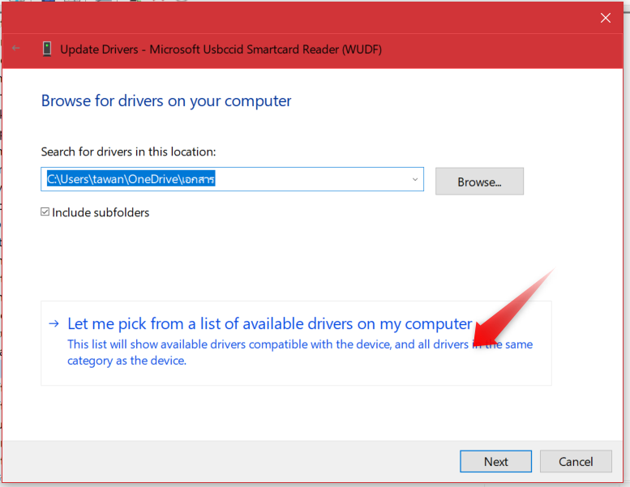
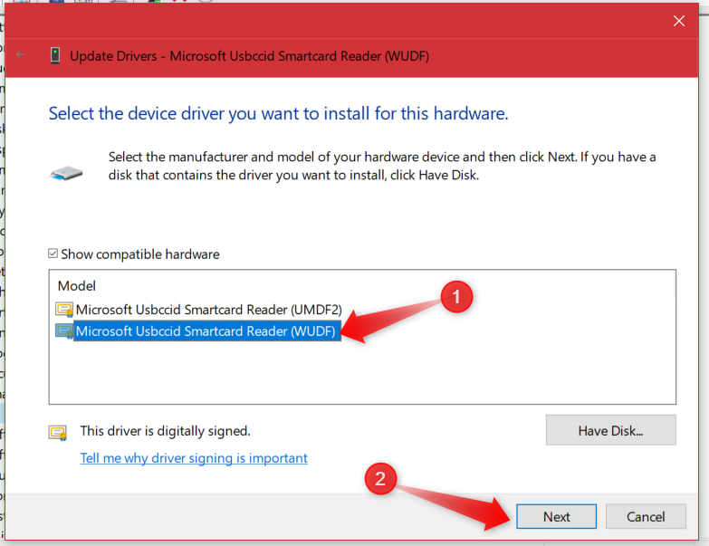
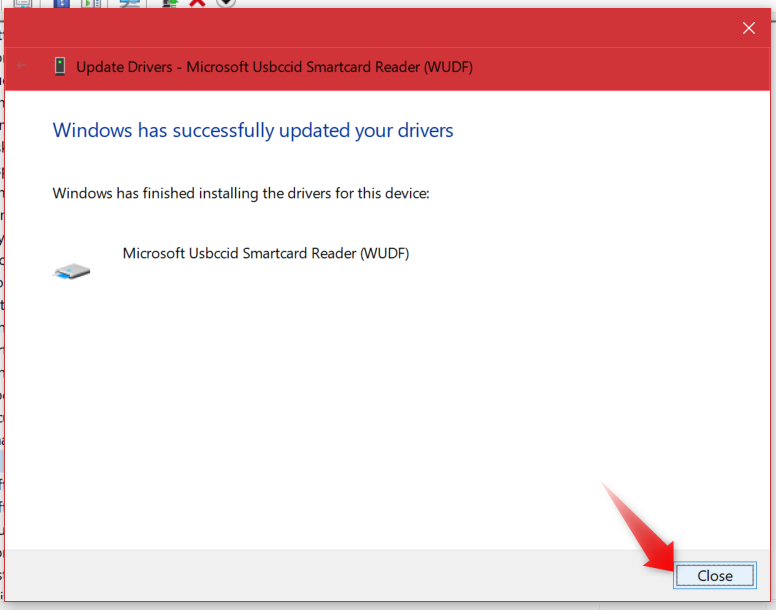
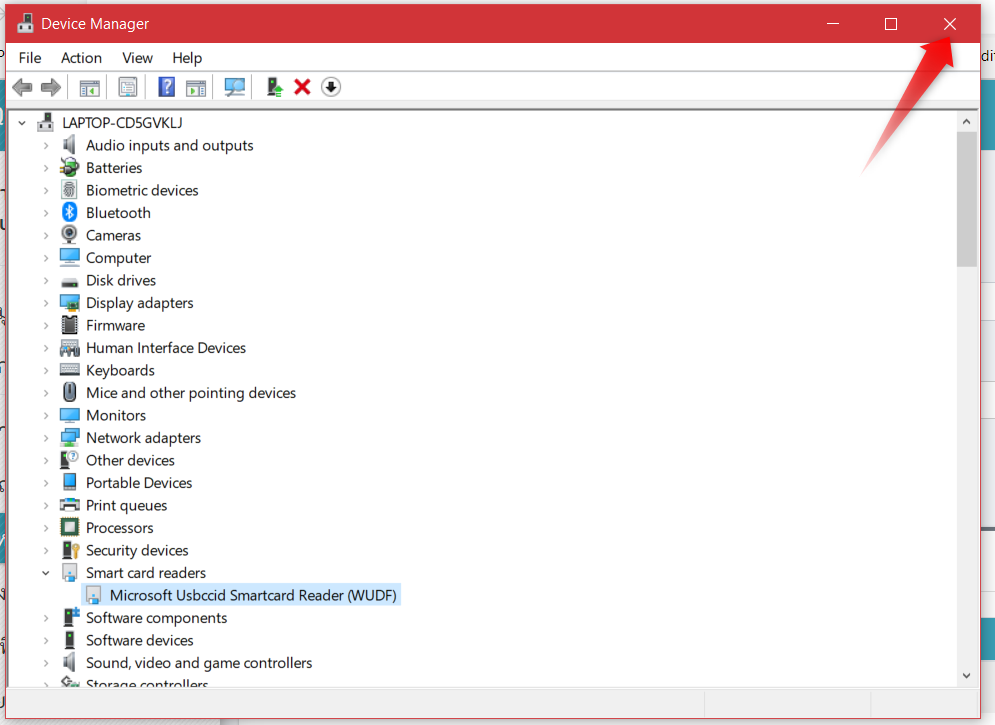

# การแก้ไขปัญหาในกรณีที่อ่านบัตรไม่ได้

- ถ้าใช้ windows 10 ให้คลิกที่ปุ่มค้นหา แล้วพิมพ์ลงไปในช่องค้นหา device จะเห็นโปรแกรม Device Manager ใหคลิก

- ให้ดูที่ **Smart card readers** แล้วคลิกที่ลูกศร `>` จะเห็นชื่อ Driver

> ในกรณีที่อ่านบัตรไม่ได้ ตรงชื่อ Driver จะขึ้นเป็นเครื่องหมายตกใจ คลิกขวาแล้วเลือก Update driver

- คลิกที่ `Let me pick from a list...`

- คลิกที่ `WUDF` แล้วคลิก `Next`

- คลิกที่ปุ่ม `Close`

