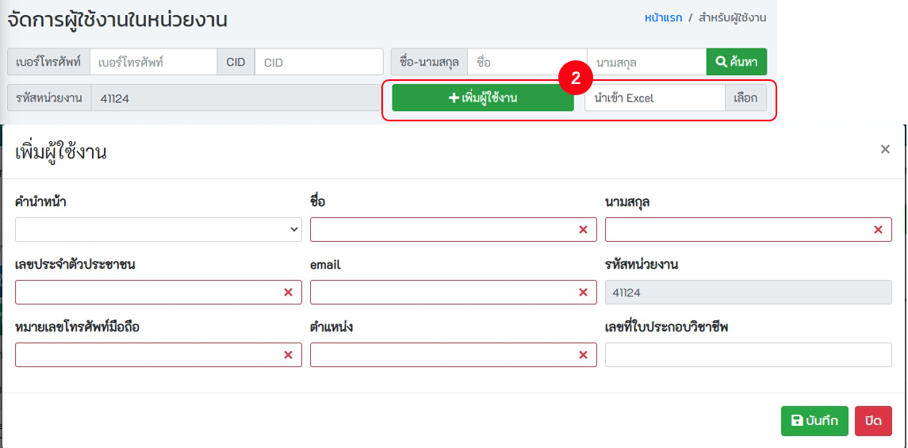

เมนูสำหรับผู้ดูแลหน่วยงาน (admin_lv1) จะเป็นเมนูสำหรับเจ้าหน้าที่ของหน่วยงานที่ได้รับผิดชอบให้ดำเนินการเพิ่มสิทธิ์ให้ผู้ใช้งานภายในหน่วยงาน (member) โดยการที่เจ้าหน้าที่ที่จะได้รับผิดชอบให้ดำเนินการเพิ่มสิทธิ์ผู้ใช้งานภายในหน่วยงาน จะต้องให้ทาง Admin ของสำนักงานสาธารณสุขหจังหวัดหรือของศูนย์เทคโนโลยีสารสนเทศและการสื่อสาร ดำเนินการเพิ่มสิทธิ์ให้ก่อน

[คลิกเพื่อดูวีดีโอ "เมนูสำหรับผู้ดูแลหน่วยงาน"](https://www.youtube.com/watch?v=lL-rHirBCoc&t=2497s)

## 3.1. การค้นหา
- คลิก! `ผู้ใช้งานในหน่วยงาน`
-	**การค้นหา** ระบุคำค้นหา เช่น บัตรประจำตัวประชาชน ชื่อ สกุล หรือ กดปุ่มค้นหา ระบบจะแสดงรายชื่อผู้ใช้งานในหน่วยงาน สามารถทำการจัดการ ลบ แก้ไขข้อมูลของผู้ใช้งานได้

## 3.2. การเพิ่มผู้ใช้งาน
[คลิกเพื่อดูวีดีโอ "ผู้ใช้งานในหน่วยงาน"](https://www.youtube.com/watch?v=lL-rHirBCoc&t=2540s)
- คลิก! `ผู้ใช้งานในหน่วยงาน`
- `เพิ่มผู้ใช้งานโดยผ่านระบบ` หรือ เพิ่มผู้ใช้งานโดยการ `import file Excel`
  - ระบุข้อมูลให้ถูกต้อง และครบถ้วน `โดยเฉพาะช่องสีแดง` กรณี import file excel รูปแบบ fileต้องถูกต้อง

