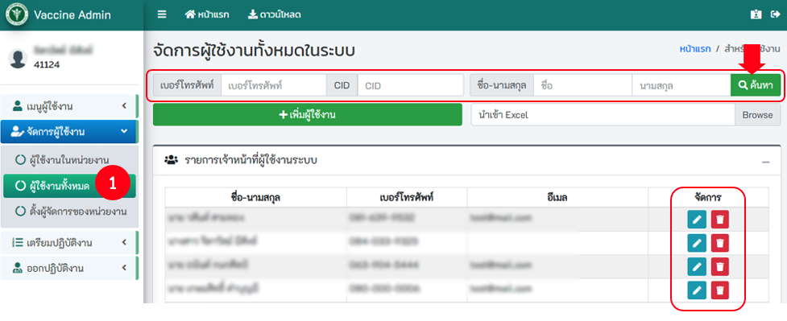
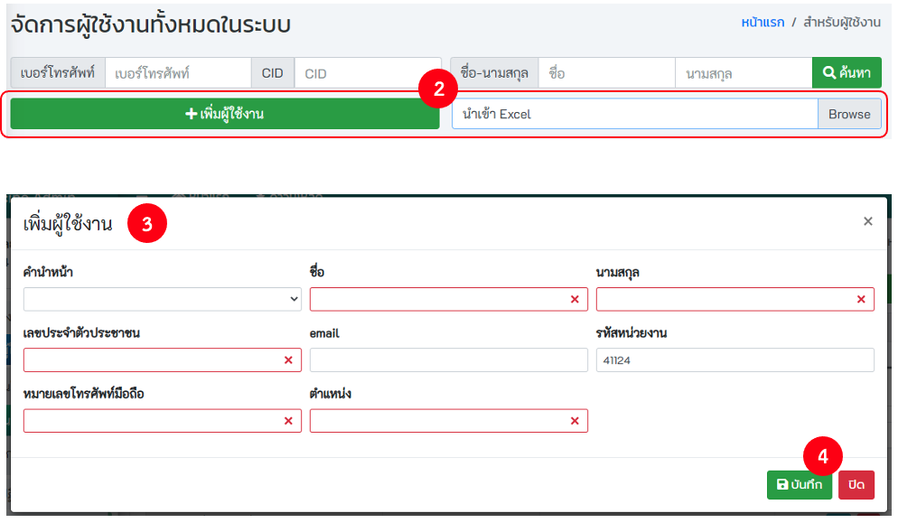
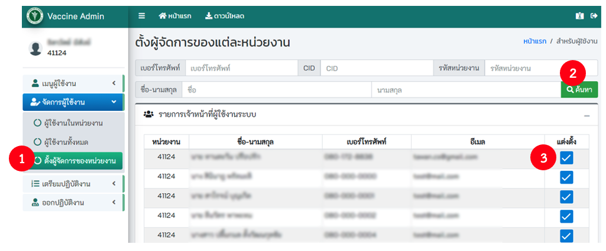

เมนูสำหรับสำนักงานสาธารณสุขจังหวัด (admin_lv2) จะเป็นเมนูสำหรับเพิ่มสิทธิ์ให้กับผู้ดูแลหน่วยงาน (admin_lv1)

## 4.1. การค้นหา
- คลิก! `ผู้ใช้งานทั้งหมด`
- **การค้นหา** ระบุคำค้นหา เช่น บัตรประจำตัวประชาชน เบอร์โทร ชื่อ สกุล หรือ กดปุ่มค้นหา ระบบจะแสดงรายชื่อผู้ใช้งานทั้งหมด สามารถทำการจัดการ ลบ แก้ไขข้อมูลของผู้ใช้งานได้

## 4.2. การเพิ่มผู้ใช้งาน
- คลิก! `ผู้ใช้งานทั้งหมด`
- `เพิ่มผู้ใช้งานโดยผ่านระบบ` หรือ เพิ่มผู้ใช้งานโดยการ `import file Excel`
  - ระบุข้อมูลให้ถูกต้อง และครบถ้วน `โดยเฉพาะช่องสีแดง` กรณี import file excel รูปแบบ fileต้องถูกต้อง

## 4.3. การแต่งตั้งผู้ดูแลหน่วยงาน

- คลิก! `ตั้งผู้จัดการของหน่วยงาน`
- ระบุเงื่อนไขที่ต้องการค้นหา เช่น บัตรประจำตัวประชาชน เบอร์โทร รหัสหน่วยงาน ชื่อ สกุล หรือ กดปุ่มค้นหา ระบบจะแสดงรายการเจ้าหน้าที่ผู้ใช้งานระบบทั้งหมด
- คลิกที่ checkbox แต่งตั้ง เพื่อเลือกรายชื่อเจ้าหน้าที่ผู้ใช้งานระบบ

