## 1.1. ขั้นตอนการใช้งาน
1. หน่วยงานที่ยังไม่มี ผู้ดูแลระบบ(admin) สามารถติดต่อ <u><b>ขอเป็น admin</b></u> ได้ โดยดูตามหนังสือจากที่นี่
[เอกสารการสมัครadmin และ แบบฟอร์มต่าง ๆ](https://co-vaccine.moph.go.th/th/downloads) 
2. ให้ admin หน่วยงาน  <u><b>เพิ่มผู้ใช้งานในหน่วยงาน</b></u>  โดยสามารถดูได้ที่ [หัวข้อ 3.2 การเพิ่มผู้ใช้งาน](admin-hosp-menu.md#_3-2-การเพิ่มผู้ใช้งาน) 
3. หน่วยงานต้อง  <u><b>สร้างแผนปฏิบัติงาน</b></u> เพื่อกำหนดวันนัดรับวัคซีน โดยดูได้ที่ [หัวข้อ 5.1 แผนปฏิบัติงาน](prepare-work.md#_5-1-แผนปฏิบัติงาน) 
4. เมื่อสร้างแผนปฏิบัติงานแล้ว admin จะต้อง <u><b>เพิ่มผู้ปฏิบัติงานในแผน</b></u> ไม่อย่างนั้น ผู้ใช้จะไม่เห็น แผน (ไม่มีให้เลือกตอน log in ) แนวคิดนี้นับรวม admin ด้วย  กรณี ไม่มีแผนให้เลือก ตอน log in ให้ admin ตรวจสอบว่า ผู้ใช้คนนั้นอยู่ในแผนปฏิบัติงานหรือไม่ โดยดูได้ที่ [หัวข้อ 5.2 เพิ่มผู้ปฏิบัติงานในแผนฯ](prepare-work.md#_5-2-เพิ่มผู้ปฏิบัติงานในแผนฯ) 
5. หน่วยงานต้อง  <u><b>เพิ่มวัคซีนข้อมูลวัคซีน</b></u> เพื่อเตรียมไปผูกกับกิจกรรมให้วัคซีน เมนูการเพิ่มวัคซีนนี้เปรียบเหมือนการนำวัคซีนเข้าคลัง เพื่อให้กิจกรรมการให้วัคซีนมาเบิกเพื่อนำไปบันทึกการฉีดได้ โดยดูได้ที่ [หัวข้อ 5.3 เมนูเพิ่มข้อมูลวัคซีน](prepare-work.md#_5-3-เมนูเพิ่มข้อมูลวัคซีน) 
6. ผู้ดูแลระบบ (Admin) ของหน่วยงานสามารถแก้ไขข้อมูลได้ทุกรายการ 
7. สามารถดูข้อความที่ส่งถึงผู้ใช้งานได้ที่  ทางขวามือด้านบนของหน้าจอ 
 

- <b>การให้วัคซีนเข็ม 1</b>  

เมื่อหน่วยงานกำหนดวันรับวัคซีนเข็ม 1 แล้ว(การสร้างแผนปฏิบัติงานเป็นการกำหนดวันรับวัคซีน เข็ม 1 และเข็ม 2)  มีผู้ปฏิบัติงานแล้ว เพิ่มผู้ปฏิบัติงานในแผนแล้ว และเพิ่มข้อมูลวัคซีนแล้ว จะสามารถดำเนินการให้วัคซีนเข็ม 1  ได้ดังนี้

1. สิ่งที่สามารถทำได้ก่อนวันให้วัคซีนจริง (ทำล่วงหน้า) 
1.1 <u><b>ผูกวัคซีนกับกิจกรรม</b></u> หน่วยงานต้องนำวัคซีนจากการเพิ่มข้อมูลวัคซีน มา ผูกกับกิจกรรมการให้วัคซีนก่อน ที่ เมนูผูกวัคซีนกับกิจกรรม เพื่อให้สามารถบันทึกการให้วัคซีนได้ หากไม่ได้ผูกวัคซีนกับกิจกรรมการให้วัคซีนนั้น เมื่อนำไปบันทึกการให้วัคซีน จะขึ้นแจ้งว่า <b>"ผิดพลาด ไม่พบวัคซีนรหัสนี้"</b> การผูกวัคซีน เปรียบเหมือนการเบิกวัคซีนจากคลังมาเพื่อบันทึก ดังนั้นหากวัคซีนใดไม่ได้ใช้ต้องลบออกจากการผูกด้วย
โดยดูได้ที่ [หัวข้อ 5.4 ผูกวัคซีนกับกิจกรรม](prepare-work.md#_5-4-ผูกวัคซีนกับกิจกรรม) 
1.2 <u><b>พิมพ์ QR Code วัคซีน</b></u> คือ การพิมพ์รหัสวัคซ๊น ที่ได้ผูกไว้กับกิจกรรมการให้วัคซีนเข็ม 1 ให้ออกมาเป็น Barcode เพื่อสะดวกในการใช้งาน ให้หน่วยงานบริหารจัดการเอง เรื่องจะติดไว้ที่ใดบ้าง เพื่อให้สะดวกต่อการทำงาน
โดยดูได้ที่ [หัวข้อ 5.5 พิมพ์ QR Code วัคซีน](prepare-work.md#_5-5-พิมพ์-qr-code-วัคซีน) 

2. สิ่งที่ทำ วันให้วัคซีนจริง  
2.1 ผู้ใช้งาน log in โดยเลือกแผนและกิจกรรมการให้วัคซีนเข็ม 1 โดยดูได้ที่ [หัวข้อ 1.2 การเข้าสู่ระบบ Log in](login.md#_1-2-การเข้าสู่ระบบ-log-in) 
2.2 ลงทะเบียนผู้รับวัคซีน หากรู้ข้อมูลผู้รับการฉีดแล้ว สามารถทำล่วงหน้าได้ โดยดูได้ที่  [หัวข้อ 6.1 ลงทะเบียนผู้รับวัคซีน](working.md#_6-1-ลงทะเบียนผู้รับวัคซีน) 
2.3 คัดกรองก่อนให้วัคซีน โดยดูได้ที่ [หัวข้อ 6.3 คัดกรองก่อนให้วัคซีน](working.md#_6-3-คัดกรองก่อนให้วัคซีน) 
2.4 การให้วัคซีน โดยดูได้ที่ [หัวข้อ 6.4 การให้วัคซีน](working.md#_6-4-การให้วัคซีน) 
2.5 จุดตรวจสอบก่อนกลับบ้าน โดยดูได้ที่ [หัวข้อ 6.5 จุดตรวจสอบก่อนกลับบ้าน](working.md#_6-5-จุดตรวจสอบก่อนกลับบ้าน) 

- <b>การให้วัคซีนเข็ม 2</b>  
ให้ทำเหมือน เข็ม 1 เริ่มตั้งแต่ ผูกวัคซีนกับกิจกรรม จนถึง จุดตรวจสอบก่อนกลับบ้าน ต่างกันแค่ ให้ Log in เข้าแผน และเลือกกิจกรรมเข็ม 2

- <b>การให้วัคซีน เข็ม 2 กรณีมาไม่ตรงวันนัด </b> 
ตัวอย่างนัดวันที่ 31 มีนาคม(เข็ม 2) ในแผน กลุ่มบุคลากร วันที่ 11 - 31 มี.ค. Sinovac แต่มาจริงวันที่ 3 เมษายน หน่วยงานกำลังปฏิบัติงานในแผนวันที่ 3 เมษายน เข็ม 2 ตามวงกลมแดงหมายเลข 1 ให้ไปเมนูผูกวัคซีนกับกิจกรรม ตามวงกลมแดงหมายเลข 2 และวัคซีนที่จะฉีดให้คนนี้คือรหัสBarcode 0000000090 ตามวงกลมแดงหมายเลข 3 ได้ผูกกับเข็มนี้แล้ว ให้ดำเนินการ  

1.ลบวัคซีนที่จะฉีดให้คนนี้ ออกจากการผูกกับเข็มปัจจุบัน(เมนูผูกวัคซีนกับกิจกรรม) โดยกดลบ ตามวงกลมแดงหมายเลข 4 จากนั้นกดบันทึกตามวงกลมแดงหมายเลข 5   
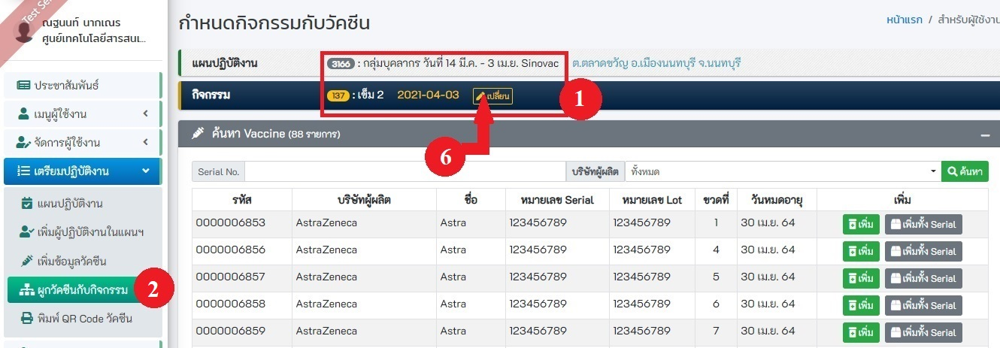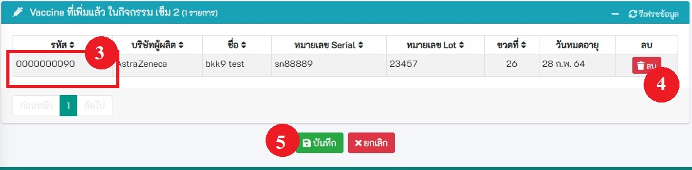    

2.เข้ากิจกรรมเข็ม 2 ในแผนที่มีเข็ม 1 อยู่ (ตามตัวอย่างคือ เข็ม 2 ของแผน กลุ่มบุคลากร วันที่ 11 - 31 มี.ค. Sinovac) 
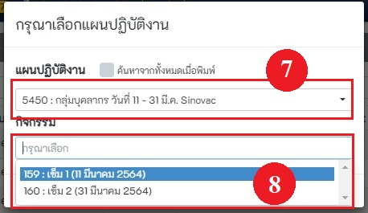  
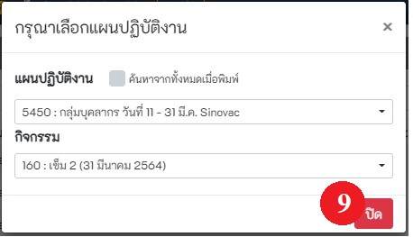   
3.เข้าเมนูผูกวัคซีน หาวัคซีนนี้ แล้วกดเพิ่ม จะเห็นว่าวัคซีนถูกเพิ่มแล้วตามกรอบสีแดง ให้กดบันทึก ตามวงกลมแดงหมายเลข 11 
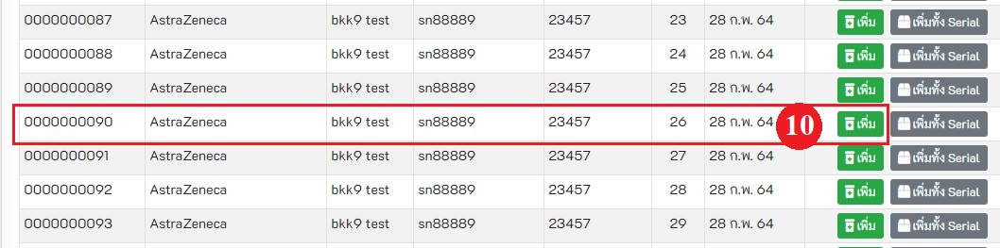 
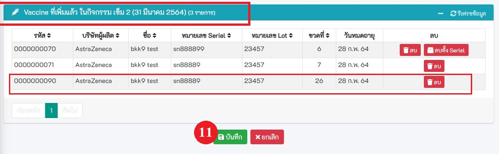   
4.เข้าเมนูออกปฏิบัติงาน ทำตั้งแต่ลงทะเบียน จน ถึงจุดตรวจสอบก่อนกลับบ้าน 
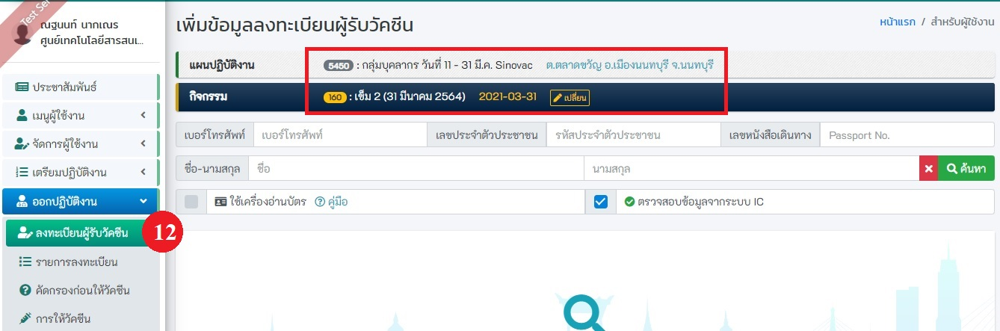  
5.สลับกิจกรรมที่ให้บริการให้เป็นแผนปัจจุบัน เพื่อบันทึกการฉีดวัคซีนผู้รับวัคซีนรายอื่นต่อไป   

## 1.2 การเข้าสู่ระบบ Log in 
- เข้าสู่ระบบ https://co-vaccine.moph.go.th
1. กรอกเลขบัตรประจำตัวประชาชน
2. คลิก! ตรวจสอบ
3. กรอกรหัสผ่านผู้ใช้งาน
4. กดยืนยันรหัสผ่าน
5. เลือกแผนปฏิบัติงาน หากไม่เจอแผนที่ต้องการ ให้ติ๊กที่คำว่า "ค้นหาจากทั้งหมดเมื่อพิมพ์" ตามวงกลมแดง หมายเลข 6 จากนั้นจะสามารถพิมพ์ค้นหาได้ ที่ช่อง ตามวงกลมแดง หมายเลข 5 
6. เลือกกิจกรรม ตามวงกลมแดง หมายเลข 7

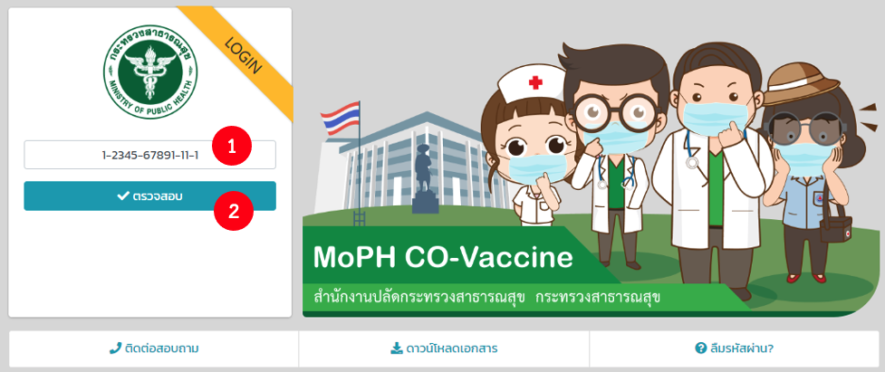
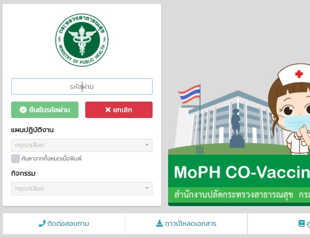
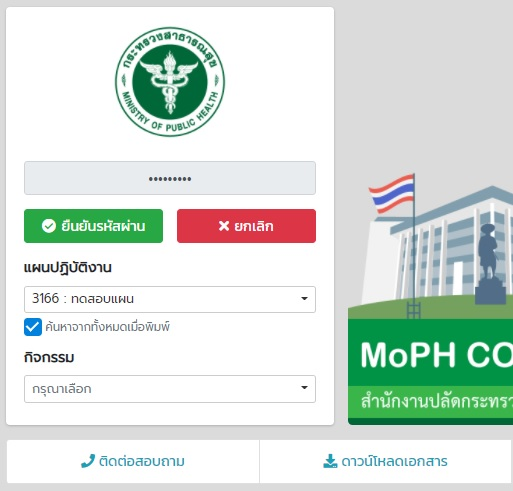
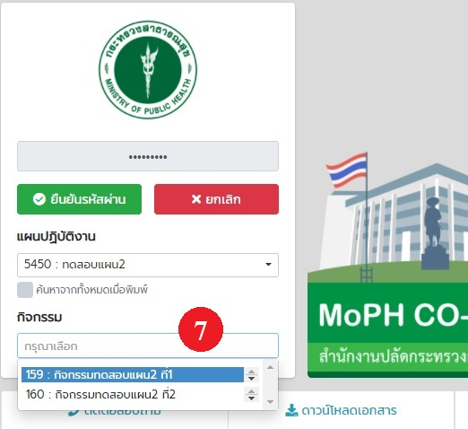

## 1.3 กรณีลืมรหัสผ่าน
กรณีลืมรหัสผ่าน ให้กดปุ่มลืมรหัสผ่าน ตามหมายเลข 1 และกรอกข้อมูลให้ครบตามแบบฟอร์มที่กำหนด ตามหมายเลข 2 หลังจากนั้น กดปุ่ม เปลี่ยนรหัสผ่าน ตามหมายเลข 3  

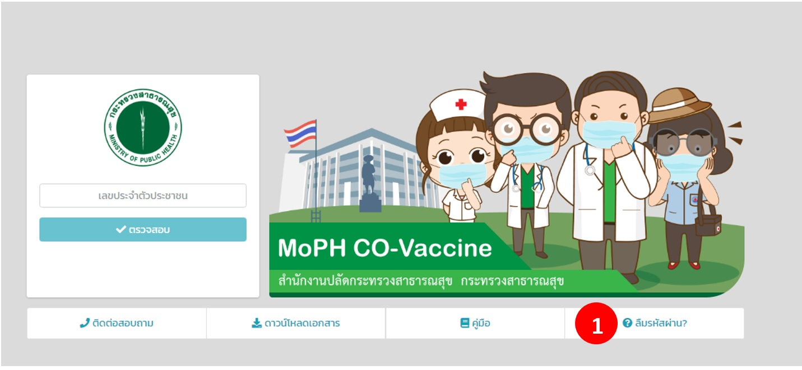 
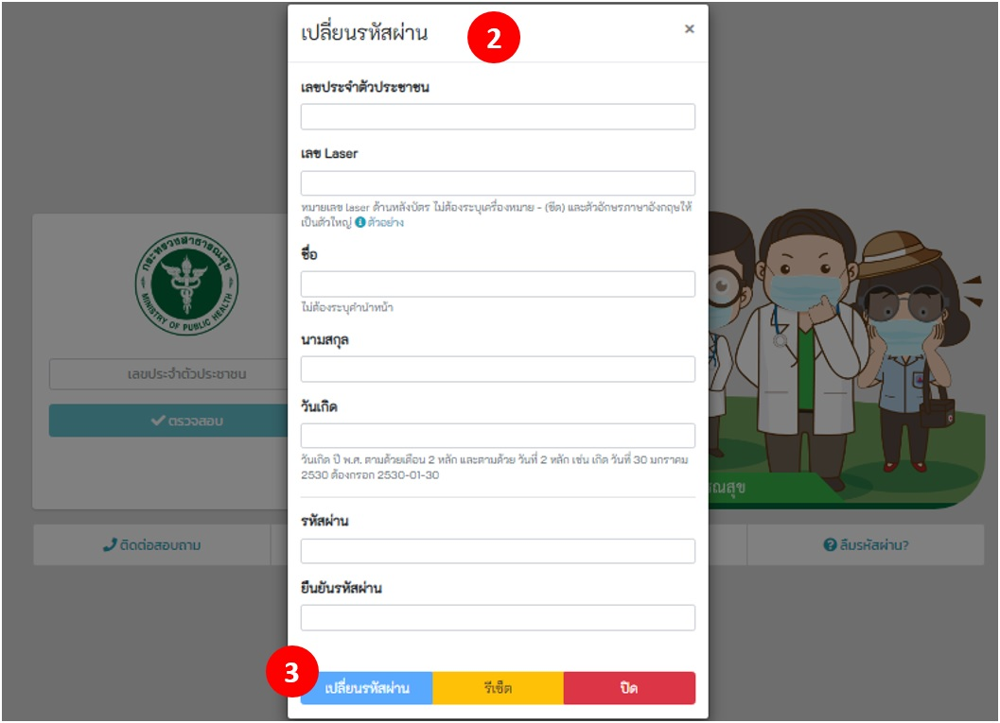