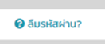
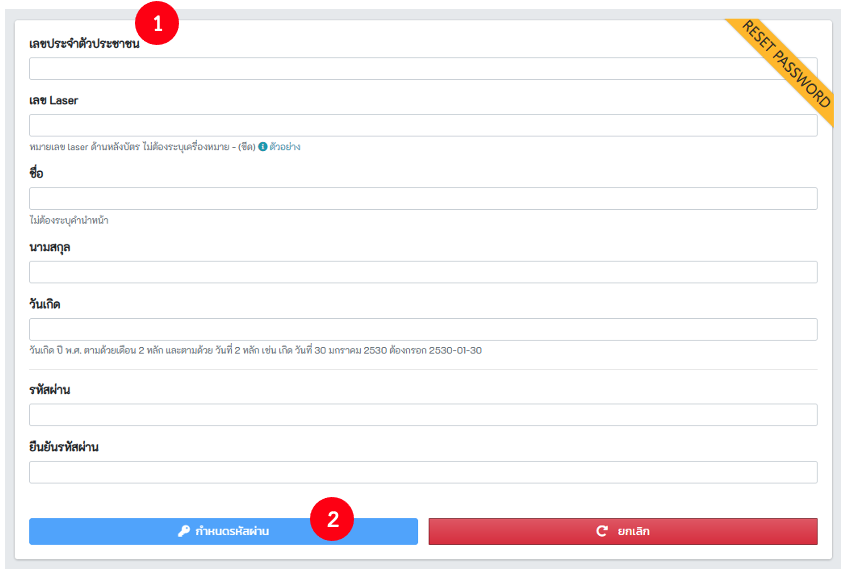

## 1.1. เข้าสู่ระบบ

- เข้าสู่ระบบ https://co-vaccine.moph.go.th
1. กรอกเลขบัตรประจำตัวประชาชน
2. คลิก! ตรวจสอบ
3. กรอกรหัสผ่านผู้ใช้งาน
4. กดยืนยันรหัสผ่าน
5. เลือกแผนปฏิบัติงาน หากไม่เจอแผนที่ต้องการ ให้ติ๊กที่คำว่า "ค้นหาจากทั้งหมดเมื่อพิมพ์" ตามวงกลมแดง หมายเลข 6 จากนั้นจะสามารถพิมพ์ค้นหาได้ ที่ช่อง ตามวงกลมแดง หมายเลข 5 
6. เลือกกิจกรรม ตามวงกลมแดง หมายเลข 7

## 1.2. กรณีลืมรหัสผ่าน
กรณีลืมรหัสผ่าน ให้กดปุ่ม  และ**กรอกข้อมูลให้ครบ**ตามแบบฟอร์มที่กำหนด หลังจากนั้น  กดปุ่ม **กำหนดรหัสผ่าน**
