# เตรียมปฏิบัติงาน
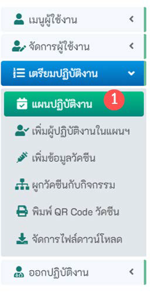

## 3.1 ค้นหาแผนปฏิบัติงาน
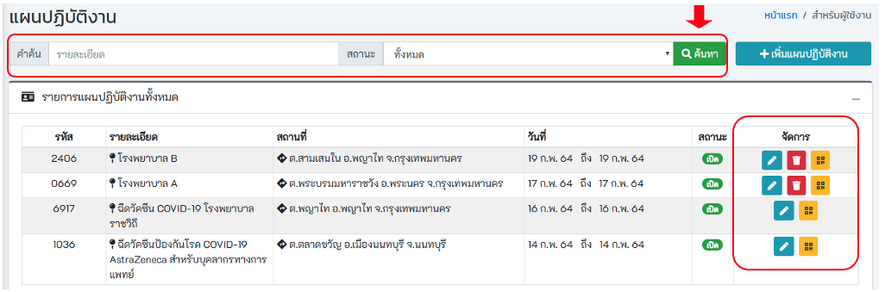

## 3.2 เพิ่มแผนปฏิบัติงาน
- คลิกปุ่ม "เพิ่มแผนปฏิบัติงาน"
- ระบุข้อมูลให้ถูกต้อง และครบถ้วน โดยเฉพาะช่องสีแดง
- ระบุ วันที่นัด (พ.ศ.-เดือน-ปี) และ รายละเอียดของแผนการให้วัคซีน หลังจากนั้นกดปุ่ม บันทึก 

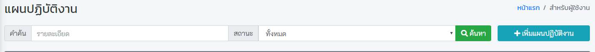
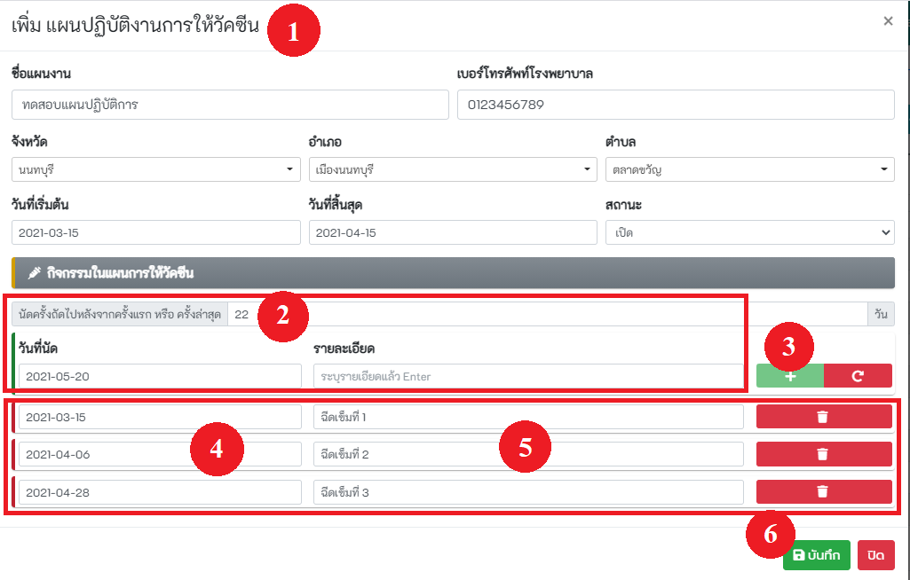

## 3.3 เพิ่มผู้ปฏิบัติงานในแผนฯ
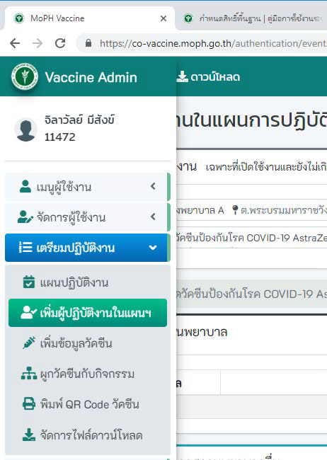
### 3.3.1 รหัสสถานบริการเดียวกัน
- เลือกแผนปฏิบัติงาน และเลือกรายชื่อผู้ปฏิบัติงานในแผน หลังจากนั้นกดปุ่ม บันทึก

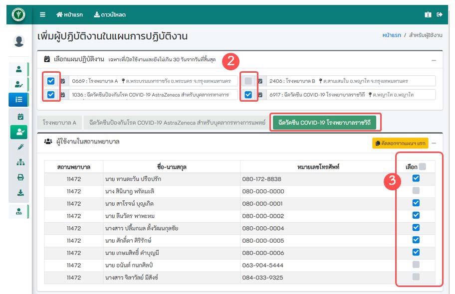

### 3.3.2 รหัสสถานบริการต่างกัน
- ระบุเงื่อนไขในการค้นหา เช่น เลขบัตรประจำตัวประชาชน รหัสสถานพยาบาล ขื่อ นามสกุล หลังจากนั้นกดปุ่ม ค้นหา
- คลิกที่ checkbox เพื่อเลือกผู้ปฏิบัติงาน หลังจากนั้นกดปุ่ม บันทึก

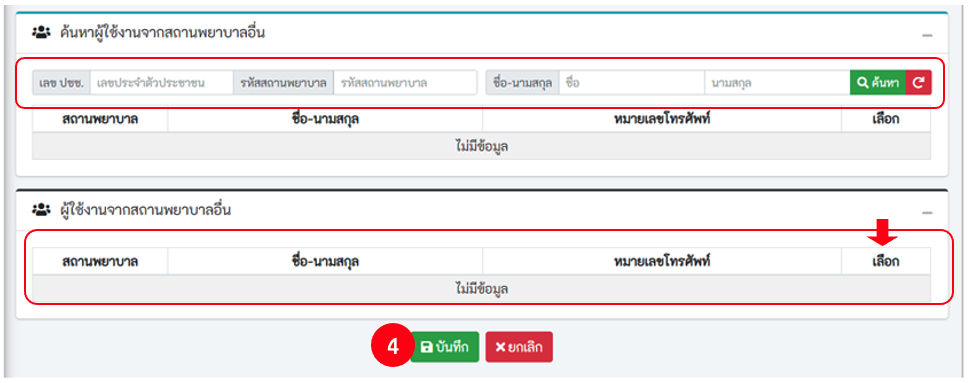

## 3.4 เพิ่มข้อมูลวัคซีน
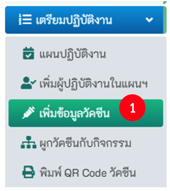

### 3.4.1 ค้นหาข้อมูลเดิม

- ระบุเงื่อนไขที่ต้องการค้นหา เช่น ชื่อวัคซีน Serial No. Lot No. จากนั้นคลิกที่ปุ่ม ค้นหา

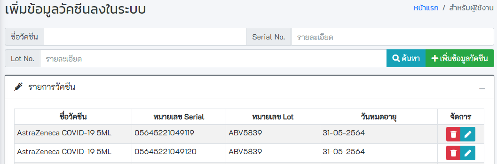

### 3.4.2 เพิ่มข้อมูลวัคซีน
- ระบุข้อมูลให้ถูกต้อง และครบถ้วน โดยเฉพาะช่องสีแดง
- หรือ กดปุ่ม Scan เพื่อทำการสแกน QR Code , Barcode , Data Matrix ที่ระบุข้างกล่อง ระบบจะทำการอ่านข้อมูล และเติมลงในช่องต่างๆ

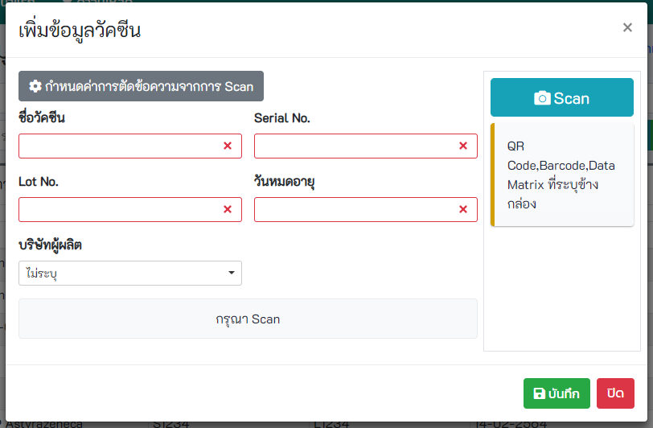

## 3.5 ผูกวัคซีนกับกิจกรรม

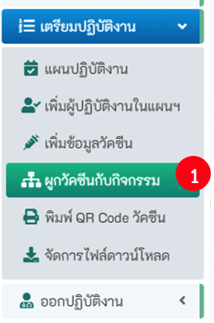

- ระบุเงื่อนไขที่ต้องการค้นหา หรือ กดปุ่มค้นหา
- แสดงข้อมูลเฉพาะวัคซีนที่ยังไม่ได้ทำการผูกกับกิจกรรม
- เลือกวัคซีน และกดปุ่ม เพิ่ม
- แสดงวัคซีนที่เลือก หลังจากนั้นกดปุ่ม บันทึก

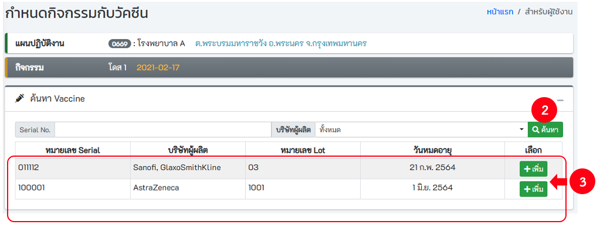
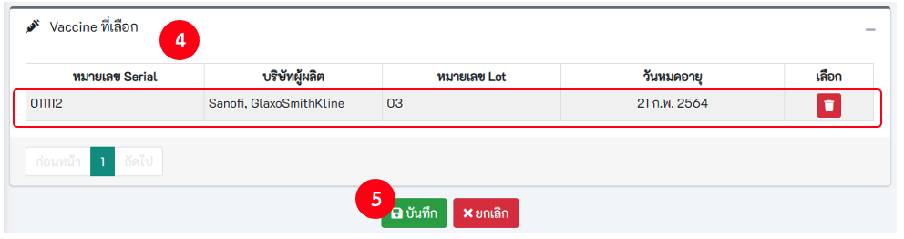

## 3.6 พิมพ์ QR Code วัคซีน
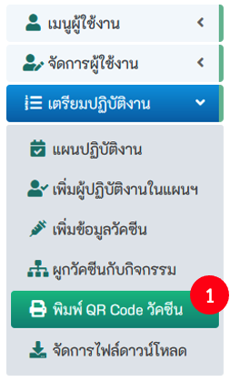
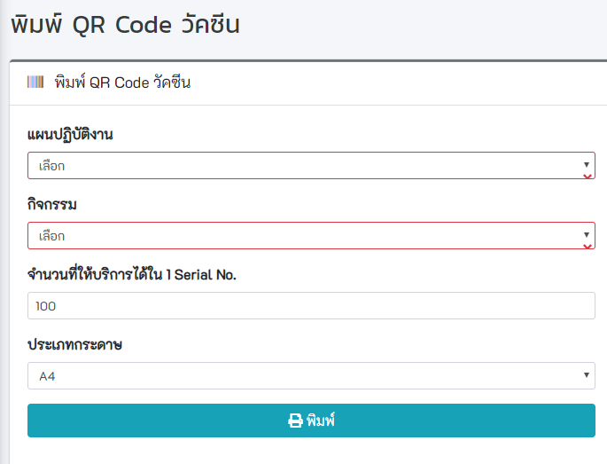
