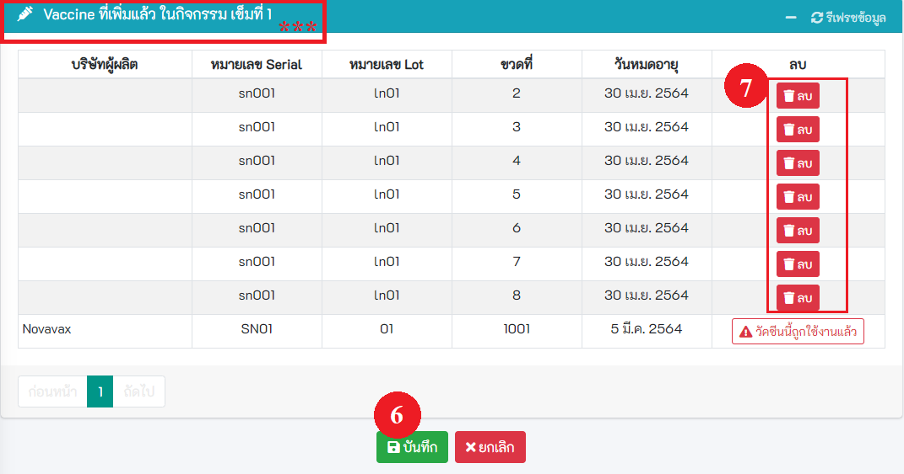

# เตรียมปฏิบัติงาน
[คลิกเพื่อดูวีดีโอ "เตรียมปฏิบัติงาน "](https://www.youtube.com/watch?v=lL-rHirBCoc&t=2756s)

## 5.1 ค้นหาแผนปฏิบัติงาน
- **การค้นหาและการจัดการ** สามารถทำการลบ และแก้ไขข้อมูลของแผนปฏิบัติงานได้
- **เพิ่มแผนปฏิบัติงานใหม่**

## 5.2 เพิ่มแผนปฏิบัติงาน
[คลิกเพื่อดูวีดีโอ "เพิ่มแผนปฏิบัติงาน"](https://www.youtube.com/watch?v=lL-rHirBCoc&t=2781s)
- คลิกปุ่ม `เพิ่มแผนปฏิบัติงาน` จะพบหน้าเพิ่มแผนปฏิบัติงานการให้วัคซีน ตามวงกลมแดงหมายเลข 1
- ระบุ รายละเอียดของแผนการให้วัคซีน ให้ครบถ้วน
- ระบุวันนัด และรายละเอียด การฉีดครั้งแรก จากนั้นใส่จำนวนวันนัดครั้งถัดไป(ระบบจะคำนวณวันที่ให้)   ตามวงกลมแดงหมายเลข 2  และกดปุ่ม + ตามวงกลมแดงหมายเลข 3 
- **หากมีการฉีดทั้งหมดมากกว่า 1 ครั้ง** ให้ทำตามวงกลมแดงหมายเลข 2 และตามวงกลมแดงหมายเลข 3 จนครบตามต้องการ  **จากรูปตัวอย่าง** ต้องการฉีดทั้งหมด 3 ครั้ง ในแผนการให้วัคซีนนี้ จะพบวันนัดทั้งหมด 3 วัน  ตามวงกลมแดงหมายเลข 4 และพบกิจกรรม 3 กิจกรรม ตามวงกลมแดงหมายเลข 5 
- **กดบันทึก** ตามวงกลมแดงหมายเลข 6

## 5.3 เพิ่มผู้ปฏิบัติงานในแผนฯ
[คลิกเพื่อดูวีดีโอ "เพิ่มผู้ปฏิบัติงานในแผนฯ"](https://www.youtube.com/watch?v=lL-rHirBCoc&t=3010s)

### 5.3.1 รหัสสถานบริการเดียวกัน
- เลือกแผนปฏิบัติงาน และเลือกรายชื่อผู้ปฏิบัติงานในแผน หลังจากนั้นกดปุ่ม **บันทึก**

### 5.3.2 กรณีเพิ่มผู้ใช้งานจากโรงพยาบาล/สถานพยาบาลอื่น
- ระบุเงื่อนไขในการค้นหา เช่น เลขบัตรประจำตัวประชาชน รหัสสถานพยาบาล ขื่อ นามสกุล หลังจากนั้นกดปุ่ม **ค้นหา**
- คลิกที่ checkbox เพื่อเลือกผู้ปฏิบัติงาน หลังจากนั้นกดปุ่ม บันทึก

## 5.4 เมนูเพิ่มข้อมูลวัคซีน
[คลิกเพื่อดูวีดีโอ "เพิ่มข้อมูลวัคซีน "](https://www.youtube.com/watch?v=lL-rHirBCoc&t=3260s)
- **กดเพิ่มข้อมูลวัคซีนจากเมนูด้านซ้าย ตามรูปหมายเลข1**

- **การค้นหาข้อมูลวัคซีน** 
  - **ระบุเงื่อนไขที่ต้องการค้นหา** เช่น ชื่อวัคซีน Serial No. Lot No. จากนั้นคลิกที่ปุ่ม ค้นหา 

- **เพิ่มข้อมูลวัคซีนรายขวด** ตามรูปหมายเลข 2
  
  - **ระบุข้อมูลให้ถูกต้อง และครบถ้วน โดยเฉพาะช่องสีแดง** 
  - **หรือ กดปุ่ม Scan** ตามรูปหมายเลข 5 เพื่อทำการสแกน QR Code , Barcode , Data Matrix ที่ระบุข้างกล่อง ระบบจะทำการอ่านข้อมูล และเติมลงในช่องต่าง ๆ
  
  - **เมื่อเสร็จแล้ว กดปุ่ม บันทึก** ตามรูปหมายเลข 4

- **เพิ่มข้อมูลวัคซีนรายกล่อง** ตามรูปหมายเลข 1
  
  - **ระบุข้อมูลให้ถูกต้อง และครบถ้วน โดยเฉพาะช่องสีแดง** 
  - **หรือ กดปุ่ม Scan** ตามรูปหมายเลข 2 เพื่อทำการสแกน QR Code , Barcode , Data Matrix ที่ระบุข้างกล่อง ระบบจะทำการอ่านข้อมูล และเติมลงในช่องต่าง ๆ
  
  - **เมื่อเสร็จแล้ว กดปุ่ม บันทึก** ตามรูปหมายเลข 3

## 5.5 ผูกวัคซีนกับกิจกรรม
[คลิกเพื่อดูวีดีโอ "ผูกวัคซีนกับกิจกรรม"](https://www.youtube.com/watch?v=lL-rHirBCoc&t=3650s)

- **เปลี่ยนกิจกรรม** ตามรูปหมายเลข 1 หากไม่ใช่กิจกรรมที่ต้องการผูกกับวัคซีน
  

  - **เลือก แผนปฎิบัติงาน และกิจกรรม** เมื่อเสร็จสิ้น กด ปิด ตามรูปหมายเลข 2
  

- หากต้องการค้นหา ให้ระบุเงื่อนไขที่ต้องการค้นหา แล้ว กดปุ่มค้นหา ตามรูปหมายเลข 3
  
  
- จะแสดงข้อมูลเฉพาะวัคซีนที่ยังไม่ได้ทำการผูกกับกิจกรรม เมื่อต้องการเลือกวัคซีน ให้กดปุ่ม **เพิ่ม** หรือ **เพิ่มทั้ง Serial** ตามรูปหมายเลข 4 หรือ 5
  

- แสดงวัคซีนที่เลือก หลังจากนั้นกดปุ่ม **บันทึก** ตามรูปหมายเลข 6
  

## 5.6 พิมพ์ QR Code วัคซีน
[คลิกเพื่อดูวีดีโอ "พิมพ์ QR Code วัคซีน"](https://www.youtube.com/watch?v=lL-rHirBCoc&t=3870s)

