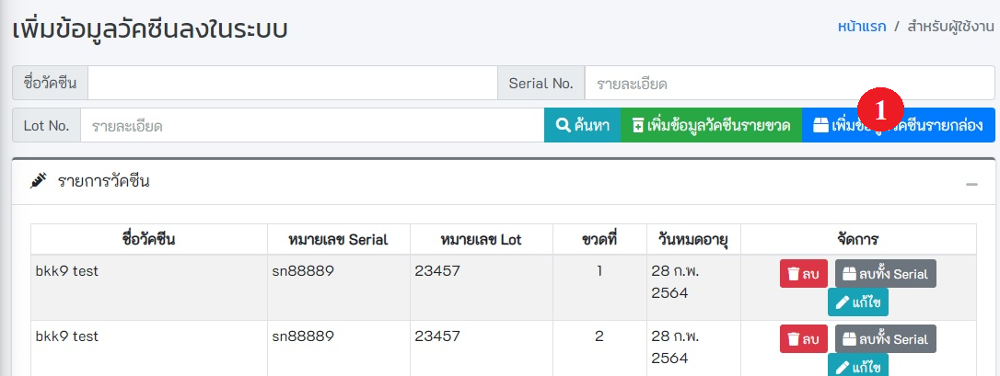
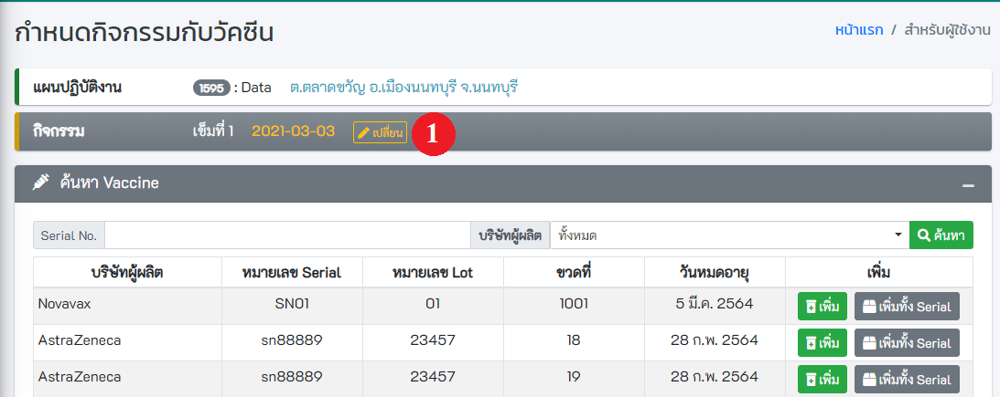
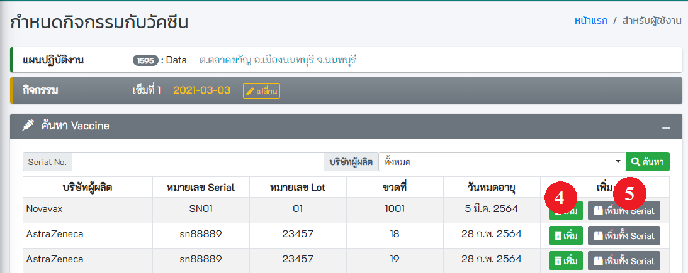

# เตรียมปฏิบัติงาน

## 5.1 ค้นหาแผนปฏิบัติงาน
- **การค้นหาและการจัดการ** สามารถทำการลบ และแก้ไขข้อมูลของแผนปฏิบัติงานได้
- **เพิ่มแผนปฏิบัติงานใหม่**

## 5.2 เพิ่มแผนปฏิบัติงาน
- คลิกปุ่ม `เพิ่มแผนปฏิบัติงาน` ตามวงกลมแดงหมายเลข 1 จะพบหน้าเพิ่มแผนปฏิบัติงานการให้วัคซีน 

- ระบุ รายละเอียดของแผนการให้วัคซีน ให้ครบถ้วน โดยปกติ 1 วันควรมี 1 แผน  **กรณีมีการให้วัคซีนต่างชนิดกัน แล้วมีวันนัดต่างกัน ควรสร้างแผนใหม่**
 ** วงกลมแดงหมายเลข 2 คือ วันเริ่มแผน ไม่ใช่วันนัด อาจตั้งเป็นวันเดียวกับวันนัด หรือก่อนวันนัดก็ได้
 ** วงกลมแดงหมายเลข 3 คือ วันนัดครั้งแรกเพื่อให้วัคซีนเข็ม1 
 ** วงกลมแดงหมายเลข 4 คือ จำนวนวันที่ให้วัคซีนครั้งถัดไป
 ** วงกลมแดงหมายเลข 5 คือ จำนวนการให้วัคซีนจนครบ เช่น Sinovac จำนวน 2 ครั้ง ก็ระบุ 2
 ** วงกลมแดงหมายเลข 6 คือ ปุ่มกดเพื่อให้ระบบสร้างแผนและจำนวนเข็มการให้วัคซีน  
 จากนั้นตรวจสอบข้อมูล ตามกรอบสีแดง เพื่อ ดูวันนัดและจำนวนเข็มการให้วัคซีน ว่าถูกต้องหรือไม่  จากนั้น กดปู่มบันทึก

**- สำคัญมาก** ในแผนต้องมีกิจกรรมการให้วัคซีนตามจำนวนเข็มเท่านั้น ห้ามสร้างเกิน เช่น Sinovac ต้องให้จำนวน 2 เข็ม ก็มี 2 เข็มเท่านั้น จำนวนรวมของกิจกรรมห้ามเกิน 2

## 5.3 เพิ่มผู้ปฏิบัติงานในแผนฯ

### 5.3.1 รหัสสถานบริการเดียวกัน
- เลือกแผนปฏิบัติงาน และเลือกรายชื่อผู้ปฏิบัติงานในแผน หลังจากนั้นกดปุ่ม **บันทึก**

### 5.3.2 กรณีเพิ่มผู้ใช้งานจากโรงพยาบาล/สถานพยาบาลอื่น
- ระบุเงื่อนไขในการค้นหา เช่น เลขบัตรประจำตัวประชาชน รหัสสถานพยาบาล ขื่อ นามสกุล หลังจากนั้นกดปุ่ม **ค้นหา**
- คลิกที่ checkbox เพื่อเลือกผู้ปฏิบัติงาน หลังจากนั้นกดปุ่ม บันทึก

## 5.4 เมนูเพิ่มข้อมูลวัคซีน

- **กดเพิ่มข้อมูลวัคซีนจากเมนูด้านซ้าย ตามรูปหมายเลข1**

- **การค้นหาข้อมูลวัคซีน** 
  - **ระบุเงื่อนไขที่ต้องการค้นหา** เช่น ชื่อวัคซีน Serial No. Lot No. จากนั้นคลิกที่ปุ่ม ค้นหา 

- **เพิ่มข้อมูลวัคซีนรายขวด** ตามวงกลมแดงหมายเลข 2
  
  - **ระบุข้อมูลให้ถูกต้อง และครบถ้วน โดยเฉพาะช่องสีแดง**   
  - **หรือ กดปุ่ม Scan** ตามวงกลมแดงหมายเลข 5 เพื่อทำการสแกน QR Code , Barcode , Data Matrix ที่ระบุข้างกล่อง ระบบจะทำการอ่านข้อมูล และเติมลงในช่องต่าง ๆ
  - ตรวจสอบจำนวนการใช้ต่อ 1 ขวด ให้ถูกต้อง ตามวงกลมแดงหมายเลข 3 เพื่อให้ระบบทราบว่าวัคซีน 1 รหัสใช้ได้กี่ครั้ง
  - **เมื่อเสร็จแล้ว กดปุ่ม บันทึก** ตามวงกลมแดงหมายเลข 4
  
  

- **เพิ่มข้อมูลวัคซีนรายกล่อง** ตามรูปหมายเลข 1
  
  - **ระบุข้อมูลให้ถูกต้อง และครบถ้วน โดยเฉพาะช่องสีแดง** 
  - **หรือ กดปุ่ม Scan** ตามวงกลมแดงหมายเลข 2 เพื่อทำการสแกน QR Code , Barcode , Data Matrix ที่ระบุข้างกล่อง ระบบจะทำการอ่านข้อมูล และเติมลงในช่องต่าง ๆ 
  - ระบบจะนำ จำนวนขวดต่อกล่อง ไปคำนวณสร้างรหัสให้เอง เช่น 10 ขวดต่อกล่อง ระบบจะสร้างรหัสวัคซีน ให้ 10 รหัส
  - ตรวจสอบจำนวนการใช้ต่อ 1 ขวด ให้ถูกต้อง ตามวงกลมแดงหมายเลข 3 เพื่อให้ระบบทราบว่าวัคซีน 1 รหัสใช้ได้กี่ครั้ง
  - **เมื่อเสร็จแล้ว กดปุ่ม บันทึก** ตามวงกลมแดงหมายเลข 4
  
  

## 5.5 ผูกวัคซีนกับกิจกรรม

- **เปลี่ยนกิจกรรม** ตามรูปหมายเลข 1 หากไม่ใช่กิจกรรมที่ต้องการผูกกับวัคซีน
  

  - **เลือก แผนปฎิบัติงาน และกิจกรรม** เมื่อเสร็จสิ้น กด ปิด ตามรูปหมายเลข 2
  

- หากต้องการค้นหา ให้ระบุเงื่อนไขที่ต้องการค้นหา แล้ว กดปุ่มค้นหา ตามรูปหมายเลข 3
  
  
- จะแสดงข้อมูลเฉพาะวัคซีนที่ยังไม่ได้ทำการผูกกับกิจกรรม เมื่อต้องการเลือกวัคซีน ให้กดปุ่ม **เพิ่ม** หรือ **เพิ่มทั้ง Serial** ตามรูปหมายเลข 4 หรือ 5
  

- แสดงวัคซีนที่เลือก หลังจากนั้นกดปุ่ม **บันทึก** ตามรูปหมายเลข 6
  

## 5.6 พิมพ์ QR Code วัคซีน

