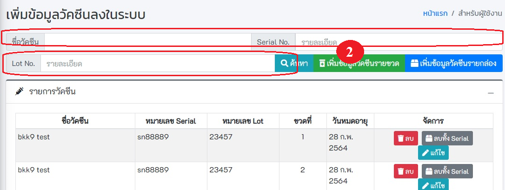
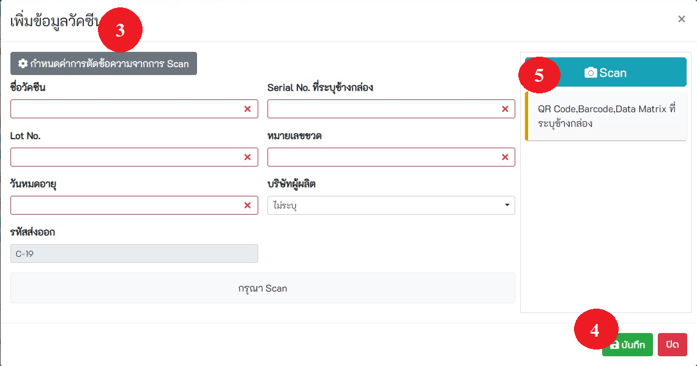
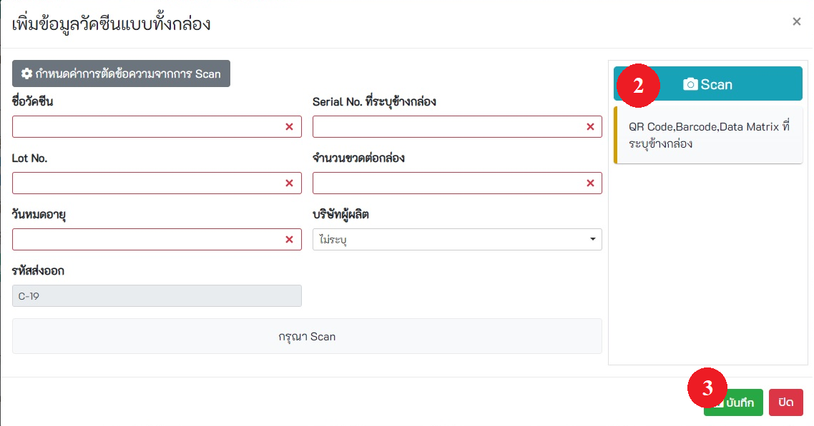
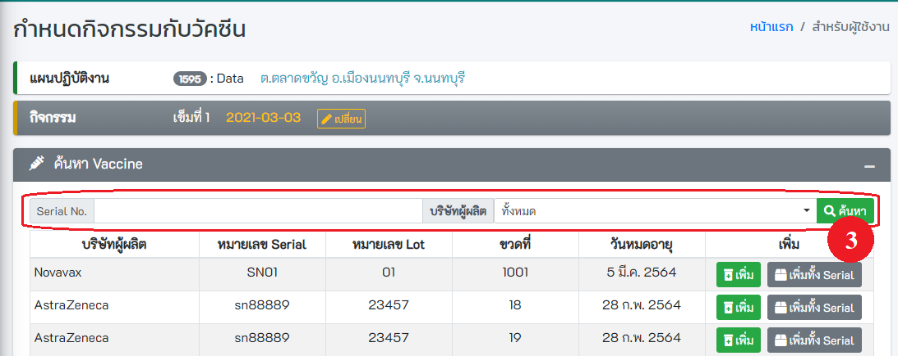

# เตรียมปฏิบัติงาน

## 5.1 ค้นหาแผนปฏิบัติงาน
- **การค้นหาและการจัดการ** สามารถทำการลบ และแก้ไขข้อมูลของแผนปฏิบัติงานได้
- **เพิ่มแผนปฏิบัติงานใหม่**

## 5.2 เพิ่มแผนปฏิบัติงาน
- คลิกปุ่ม `เพิ่มแผนปฏิบัติงาน`
- ระบุ วันที่นัด (พ.ศ.-เดือน-ปี) และ รายละเอียดของแผนการให้วัคซีน หลังจากนั้นกดปุ่ม บันทึก 
- **กรณีมีการนัดครั้งถัดไป** ให้ใส่จำนวนวันนัด และกดปุ่ม + ระบบจะคำนวณวันนัดให้วัคซีนครั้งถัดไปโดยอัตโนมัติ หรือ ระบุ วันที่นัด **(พ.ศ.-เดือน-ปี)**  และใส่รายละเอียด หลังจากนั้นกดปุ่ม **บันทึก**

## 5.3 เพิ่มผู้ปฏิบัติงานในแผนฯ

### 5.3.1 รหัสสถานบริการเดียวกัน
- เลือกแผนปฏิบัติงาน และเลือกรายชื่อผู้ปฏิบัติงานในแผน หลังจากนั้นกดปุ่ม **บันทึก**

### 5.3.2 กรณีเพิ่มผู้ใช้งานจากโรงพยาบาล/สถานพยาบาลอื่น
- ระบุเงื่อนไขในการค้นหา เช่น เลขบัตรประจำตัวประชาชน รหัสสถานพยาบาล ขื่อ นามสกุล หลังจากนั้นกดปุ่ม **ค้นหา**
- คลิกที่ checkbox เพื่อเลือกผู้ปฏิบัติงาน หลังจากนั้นกดปุ่ม บันทึก

## 5.4 เมนูเพิ่มข้อมูลวัคซีน
- **กดเพิ่มข้อมูลวัคซีนจากเมนูด้านซ้าย ตามรูปหมายเลข1**

- **การค้นหาข้อมูลวัคซีน** 
  - **ระบุเงื่อนไขที่ต้องการค้นหา** เช่น ชื่อวัคซีน Serial No. Lot No. จากนั้นคลิกที่ปุ่ม ค้นหา 

- **เพิ่มข้อมูลวัคซีนรายขวด** ตามรูปหมายเลข 2
  
  - **ระบุข้อมูลให้ถูกต้อง และครบถ้วน โดยเฉพาะช่องสีแดง** 
  - **หรือ กดปุ่ม Scan** ตามรูปหมายเลข 5 เพื่อทำการสแกน QR Code , Barcode , Data Matrix ที่ระบุข้างกล่อง ระบบจะทำการอ่านข้อมูล และเติมลงในช่องต่าง ๆ
  
  - **เมื่อเสร็จแล้ว กดปุ่ม บันทึก** ตามรูปหมายเลข 4

- **เพิ่มข้อมูลวัคซีนรายกล่อง** ตามรูปหมายเลข 1
  
  - **ระบุข้อมูลให้ถูกต้อง และครบถ้วน โดยเฉพาะช่องสีแดง** 
  - **หรือ กดปุ่ม Scan** ตามรูปหมายเลข 2 เพื่อทำการสแกน QR Code , Barcode , Data Matrix ที่ระบุข้างกล่อง ระบบจะทำการอ่านข้อมูล และเติมลงในช่องต่าง ๆ
  
  - **เมื่อเสร็จแล้ว กดปุ่ม บันทึก** ตามรูปหมายเลข 3

## 5.5 ผูกวัคซีนกับกิจกรรม

- **เปลี่ยนกิจกรรม** ตามรูปหมายเลข 1 หากไม่ใช่กิจกรรมที่ต้องการผูกกับวัคซีน
  

  - **เลือก แผนปฎิบัติงาน และกิจกรรม** เมื่อเสร็จสิ้น กด ปิด ตามรูปหมายเลข 2
  

- หากต้องการค้นหา ให้ระบุเงื่อนไขที่ต้องการค้นหา แล้ว กดปุ่มค้นหา ตามรูปหมายเลข 3
  
  
- จะแสดงข้อมูลเฉพาะวัคซีนที่ยังไม่ได้ทำการผูกกับกิจกรรม เมื่อต้องการเลือกวัคซีน ให้กดปุ่ม **เพิ่ม** หรือ **เพิ่มทั้ง Serial** ตามรูปหมายเลข 4 หรือ 5
  

- แสดงวัคซีนที่เลือก หลังจากนั้นกดปุ่ม **บันทึก** ตามรูปหมายเลข 6
  

## 5.6 พิมพ์ QR Code วัคซีน

