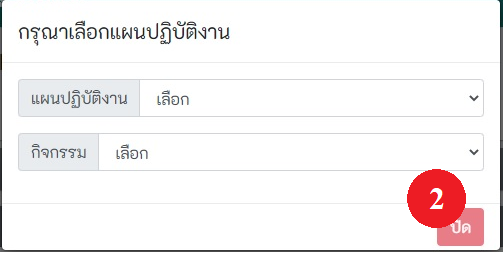
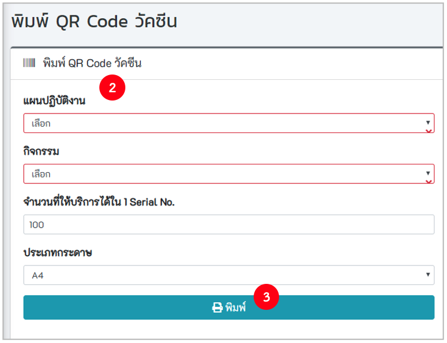
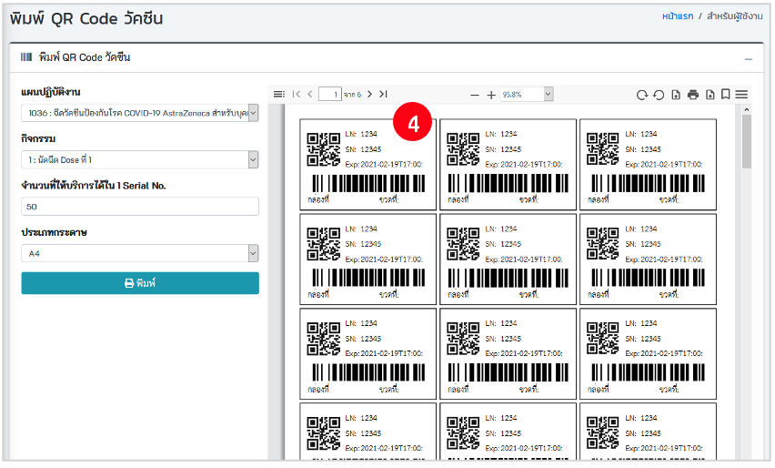
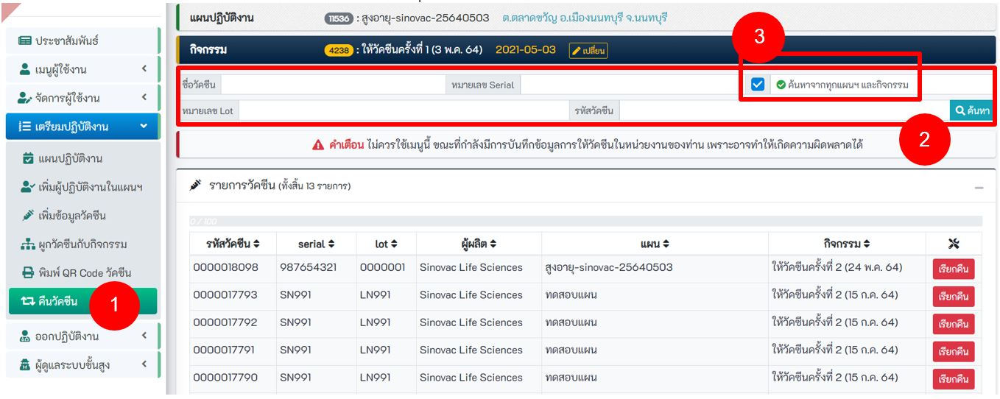
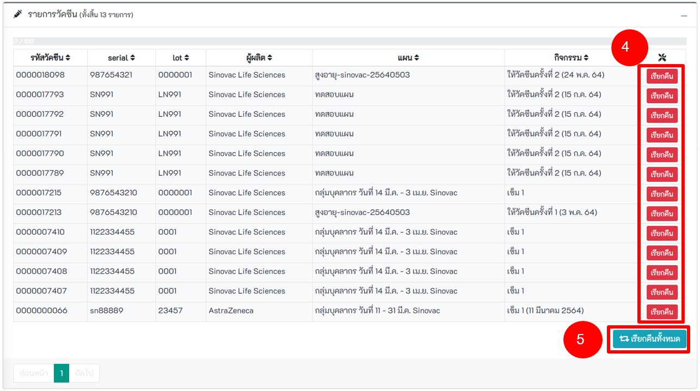

# เตรียมปฏิบัติงาน
เป็นเมนู สำหรับ เมนูย่อย ของการเตรียมข้อมูลต่าง ๆ ก่อนออกปฏิบัติงานการให้วัคซีน ประกอบด้วย เมนูย่อยดังนี้

## 5.1 แผนปฏิบัติงาน

แผนปฏิบัติงาน คือ แผนให้บริการผู้รับการฉีดวัคซีน ที่ต้องสร้างก่อนออกปฏิบัติงาน 
จุดประสงค์หลักเพื่อ ออกใบนัดรับวัคซีนครั้งต่อไป(ในแผนจะให้กำหนดวันรับวัคซีนครั้งที่ 2 กรณีต้องฉีด 2 เข็ม)และ ใช้ตรวจสอบว่าผู้รับวัคซีนได้รับวัคซีนครบตามแผนหรือไม่( เช่นsinovacต้องรับ 2 เข็ม
ดังนั้นผู้รับวัคซีน 1 คนจะอยู่ได้แค่แผนปฏิบัติงานเดียวเท่านั้น ) กรณี ผู้รับวัคซีนมารับวัคซีน ครั้งที่ 2 ไม่ตรงวันนัด ให้เจ้าหน้าที่เลือก แผนปฏิบัติงาน ที่มีเข็มที่1 ของผู้รับวัคซีน ขึ้นมาใช้งาน เพื่อให้ครบ 2 เข็ม ในแผนเดียวกัน 
 **โดยปกติ แผนปฏิบัติงาน ควรมี 1 แผน ต่อ 1 วัน ยกเว้นมีการให้วัคซีน ต่างชนิดกัน และมีวันนัดเข็มต่อไปต่างกัน ในวันนั้นควรมี 2 แผนปฏิบัติงาน**

### 5.1.1 เพิ่มแผนปฏิบัติงาน
- คลิกปุ่ม `เพิ่มแผนปฏิบัติงาน` ตามวงกลมแดงหมายเลข 1 จะพบหน้าเพิ่มแผนปฏิบัติงานการให้วัคซีน 

- การตั้งชื่อแผน ควรประกอบด้วย กลุ่มเป้าหมาย ชื่อวัคซีน และวันที่ เป็นอย่างน้อย เพื่อความสะดวกของหน่วยงานเอง ในการเลือกใช้งาน
- ระบุ รายละเอียดของแผนการให้วัคซีน ให้ครบถ้วน 
  วงกลมแดงหมายเลข 2 คือ วันเริ่มแผน ไม่ใช่วันนัด อาจตั้งเป็นวันเดียวกับวันนัด หรือก่อนวันนัดก็ได้
  วงกลมแดงหมายเลข 3 คือ วันนัดครั้งแรกเพื่อให้วัคซีนเข็ม1 
  วงกลมแดงหมายเลข 4 คือ จำนวนวันที่ให้วัคซีนครั้งถัดไป
  วงกลมแดงหมายเลข 5 คือ จำนวนการให้วัคซีนจนครบ เช่น Sinovac จำนวน 2 ครั้ง ก็ระบุ 2
  วงกลมแดงหมายเลข 6 คือ ปุ่มกดเพื่อให้ระบบสร้างแผนและจำนวนเข็มการให้วัคซีน  
 จากนั้นตรวจสอบข้อมูล ตามกรอบสีแดง เพื่อ ดูวันนัดและจำนวนเข็มการให้วัคซีน ว่าถูกต้องหรือไม่  จากนั้น กดปู่มบันทึก

**- สำคัญมาก** ในแผนต้องมีกิจกรรมการให้วัคซีนตามจำนวนเข็มเท่านั้น ห้ามสร้างเกิน เช่น Sinovac ต้องให้จำนวน 2 เข็ม ก็มี 2 เข็มเท่านั้น จำนวนรวมของกิจกรรมห้ามเกิน 2 **ห้ามสร้างกิจกรรมเกินเด็ดขาด**

### 5.1.2 การค้นหาและการจัดการ สามารถทำการลบ และแก้ไขข้อมูลของแผนปฏิบัติงานได้
- **ค้นหาแผนปฏิบัติงาน** สามารถใส่คำค้นและกดค้นหาได้จากกรอบวงแดงตามรูป
  วงกลมแดงหมายเลข 1 คือ ปุ่มเข้าแก้ไขแผน การแก้ไขแผนดูได้ที่ หัวข้อ 5.1.3 
  วงกลมแดงหมายเลข 2 คือ จำนวนผู้รับวัคซีนทั้งหมดในแผนนั้น โดยเป็นตัวเลขของเข็ม1และเข็ม2 บวกกัน 
  วงกลมแดงหมายเลข 3 คือ ปุ่มลบแผน จะปรากฏเมื่อ ไม่มีผู้รับวัคซีนในแผนนั้น 
** ข้อสำคัญให้ลบการผูกวัคซีนที่ยังไม่ได้ใช้ ออกจากกิจกรรมในแผนทุกครั้ง ก่อนการลบแผน ดูหัวข้อ 5.4 ล่างสุด เรื่องการลบการผูกวัคซีน **

### 5.1.3 การแก้ไขข้อมูลของแผนปฏิบัติงาน
**ข้อสำคัญห้ามกด วงกลมแดงหมายเลข 1 และลบการผูกวัคซีนที่ยังไม่ได้ใช้ ออกจากกิจกรรมในแผนทุกครั้ง ก่อนการแก้ไข ดูหัวข้อ 5.4 ล่างสุด เรื่องการลบการผูกวัคซีน** กรณีต้องการเปลี่ยนวันที่นัด ยกทั้งแผนปฏิบัติงานให้กดในกรอบตาม วงกลมแดงหมายเลข 2 เพื่อเลือกวันที่ด้วยตนเอง
ระบบไม่สามารถแก้ไขการนัดเป็นรายคนได้ 
  วงกลมแดงหมายเลข 3 คือ ข้อมูลบอกว่ามีผู้รับวัคซีนเข็มนั้นจำนวนเท่าไหร่ จากตัวอย่าง มีผู้รับวัคซีนเข็ม 1 จำนวน 1 คน เข็ม 2 จำนวน 1 คน

## 5.2 เพิ่มผู้ปฏิบัติงานในแผนฯ

### 5.2.1 รหัสสถานบริการเดียวกัน
- เลือกแผนปฏิบัติงาน และเลือกรายชื่อผู้ปฏิบัติงานในแผน หลังจากนั้นกดปุ่ม **บันทึก**

### 5.2.2 กรณีเพิ่มผู้ใช้งานจากโรงพยาบาล/สถานพยาบาลอื่น
- ระบุเงื่อนไขในการค้นหา เช่น เลขบัตรประจำตัวประชาชน รหัสสถานพยาบาล ขื่อ นามสกุล หลังจากนั้นกดปุ่ม **ค้นหา**
- คลิกที่ checkbox เพื่อเลือกผู้ปฏิบัติงาน หลังจากนั้นกดปุ่ม บันทึก
 

## 5.3 เมนูเพิ่มข้อมูลวัคซีน
เนื้อหา 1.การค้นหา 2.การเพิ่มข้อมูลรายขวด 3.การเพิ่มข้อมูลรายกล่อง  4.การแก้ไขข้อมูลวัคซีนที่ฉีดไปแล้ว

- **การค้นหาข้อมูลวัคซีน** 
  -**ระบุเงื่อนไขที่ต้องการค้นหา** เช่น ชื่อวัคซีน Serial No. Lot No. จากนั้นคลิกที่ปุ่ม ค้นหา 

- **เพิ่มข้อมูลวัคซีนรายขวด** ตามวงกลมแดงหมายเลข 2
  
  -**ระบุข้อมูลให้ถูกต้อง และครบถ้วน โดยเฉพาะช่องสีแดง**    
  -**หรือ กดปุ่ม Scan** ตามวงกลมแดงหมายเลข 5 เพื่อทำการสแกน QR Code , Barcode , Data Matrix ที่ระบุข้างกล่อง ระบบจะทำการอ่านข้อมูล และเติมลงในช่องต่าง ๆ  
  -ตรวจสอบจำนวนการใช้ต่อ 1 ขวด ให้ถูกต้อง ตามวงกลมแดงหมายเลข 3 เพื่อให้ระบบทราบว่าวัคซีน 1 รหัสใช้ได้กี่ครั้ง  
  -**เมื่อเสร็จแล้ว กดปุ่ม บันทึก** ตามวงกลมแดงหมายเลข 4 
  
    

- **เพิ่มข้อมูลวัคซีนรายกล่อง** ตามรูปหมายเลข 1
  
  -**ระบุข้อมูลให้ถูกต้อง และครบถ้วน โดยเฉพาะช่องสีแดง** 
  -**หรือ กดปุ่ม Scan** ตามวงกลมแดงหมายเลข 2 เพื่อทำการสแกน QR Code , Barcode , Data Matrix ที่ระบุข้างกล่อง ระบบจะทำการอ่านข้อมูล และเติมลงในช่องต่าง ๆ    
  -ระบบจะนำ จำนวนขวดต่อกล่อง ไปคำนวณสร้างรหัสให้เอง เช่น 10 ขวดต่อกล่อง ระบบจะสร้างรหัสวัคซีน ให้ 10 รหัส   
  -ตรวจสอบจำนวนการใช้ต่อ 1 ขวด ให้ถูกต้อง ตามวงกลมแดงหมายเลข 3 เพื่อให้ระบบทราบว่าวัคซีน 1   รหัสใช้ได้กี่ครั้ง
  -**เมื่อเสร็จแล้ว กดปุ่ม บันทึก** ตามวงกลมแดงหมายเลข 4 
  
    

- **การแก้ไขข้อมูลวัคซีนที่ฉีดไปแล้ว**  
การแก้ไขวัคซีนที่ฉีดไปแล้ว แล้วมีข้อมูลวัคซีนผิดพลาดเล็กน้อยเช่น พิมพ์ serial หรือ Lot ผิด พิมพ์ตกไป1ตัวอักษร เป็นต้น การแก้ไขมีความเสี่ยงผิดพลาดจากขั้นตอน ลบข้อมูลออกจากระบบ MOPH IC ให้ตรวจสอบข้อมูลให้ถูกต้อง และการแก้ไขอาจกระทบกับระบบหมอพร้อมของผู้รับวัคซีนรายนั้นได้ 
ก่อนจะแก้ไขได้ต้องทราบว่า barcode ของวัคซีนที่จะแก้ไขนั้น ฉีดให้ใคร และต้องดำเนินการโดยเจ้าหน้าที่ ที่บันทึกผู้รับวัคซีนรายนั้นเท่านั้น เพราะผู้อื่นไม่สามารถกดลบตามขั้นตอนที่ 2 ได้ เมื่อทราบแล้วให้ดำเนินการตามขั้นตอนดังนี้
จากรูปตัวอย่าง ต้องการแก้ วัคซีน barcode 0000000066 สังเกตุว่าจะขึ้นสถานะใช้งานแล้ว
    
  -ขั้นตอนที่ 1 เข้าเมนูออกปฏิบัติงาน->รายการลงทะเบียน ค้นหาผู้รับวัคซีนที่ได้รับวัคซีนที่ต้องการแก้ไข   
  -ขั้นตอนที่ 2 กดปุ่มลบ ตามวงกลมแดงหมายเลข 2
    
  -ขั้นตอนที่ 3 กดปุ่มใช่ เพื่อยีนยันการลบ
    
  -ขั้นตอนที่ 4 เลือกเมนู เตรียมปฏิบัติงาน->เพิ่มข้อมูลวัคซีน จะพบว่า วัคซีน Barcode 0000000066 สามารถแก้ไขได้แล้ว ให้กดแก้ไขได้เลย
    
  -ขั้นตอนที่ 5 บันทึกข้อมูลการให้วัคซีนอีกครั้งตั้งแต่ ลงทะเบียน จนถึงอนุญาตให้กลับบ้านได้  
  -ขั้นตอนที่ 6 ลบข้อมูลการฉีดด้วยวัคซีนที่ไม่ถูกต้องออกจากระบบ [MOPH Immunization Center Dashboard](https://cvp1.moph.go.th/dashboard/)(MOPH IC) ให้เหลือแต่ข้อมูลที่ถูกต้อง

## 5.4 ผูกวัคซีนกับกิจกรรม
ผูกวัคซีนกับกิจกรรม หน่วยงานต้องนำวัคซีนจากการเพิ่มข้อมูลวัคซีน มา ผูกกับกิจกรรมการให้วัคซีนก่อน เพื่อให้สามารถบันทึกการให้วัคซีนได้ หากไม่ได้ผูกวัคซีนกับกิจกรรมการให้วัคซีนนั้น เมื่อนำไปบันทึกการให้วัคซีน จะขึ้นแจ้งว่า "ผิดพลาด ไม่พบวัคซีนรหัสนี้" การผูกวัคซีน เปรียบเหมือนการเบิกวัคซีนจากคลังมาเพื่อบันทึก ดังนั้นหากวัคซีนใดไม่ได้ใช้ต้องลบออกจากการผูกด้วย

- **เปลี่ยนกิจกรรม** ตามรูปหมายเลข 1 หากไม่ใช่กิจกรรมที่ต้องการผูกกับวัคซีน
  

  - **เลือก แผนปฎิบัติงาน และกิจกรรม** เมื่อเสร็จสิ้น กด ปิด ตามรูปหมายเลข 2
  

- หากต้องการค้นหา ให้ระบุเงื่อนไขที่ต้องการค้นหา แล้ว กดปุ่มค้นหา ตามรูปหมายเลข 3
  
  
- จะแสดงข้อมูลเฉพาะวัคซีนที่ยังไม่ได้ทำการผูกกับกิจกรรม เมื่อต้องการเลือกวัคซีน ให้กดปุ่ม **เพิ่ม** หรือ **เพิ่มทั้ง Serial** ตามรูปหมายเลข 4 หรือ 5
  

- แสดงวัคซีนที่เลือก หลังจากนั้นกดปุ่ม **บันทึก** ตามรูปหมายเลข 6
  
- **การลบการผูกวัคซีน** ให้กดปุ่ม "ลบ" ในกรอบตามวงกลมแดงหมายเลข 7 ข้อควรระวัง ให้สังเกตุกรอบสีแดง การลบการผูกวัคซีนต้องอยู่ในหัวข้อนี้ หลังจากนั้นกดปุ่ม **บันทึก** วงกลมแดงหมายเลข 6 วัคซีนที่ลบจากการผูกจะสามารถนำไปผูกกับเข็มของแผนอื่นได้

## 5.5 พิมพ์ QR Code วัคซีน
- เป็นการพิมพ์รหัสวัคซีน ที่ได้ผูกไว้กับกิจกรรมการให้วัคซีน( เข็ม1 หรือ 2) ให้ออกมาเป็น Barcode เพื่อสะดวกในการใช้งาน ให้หน่วยงานบริหารจัดการเอง เรื่องจะติดไว้ที่ใดบ้าง เพื่อให้สะดวกต่อการทำงาน
 

## 5.6 คืนวัคซีน
การคืนวัคซีนเป็นการนำวัคซีนที่ได้มีการผูกกิจกรรมไว้เรียบร้อยแล้วแต่ยังไม่ได้ใช้งานคืนกลับไปในระบบเพื่อให้สามารถนำวัคซีนเหล่านั้นกลับมาใช้งานในกิจกรรมอื่น ๆ ได้ โดยสามารถใช้งานเมนูคืนวัคซีนได้ตามหมายเลข 1
### 5.6.1 ค้นหา
- ระบุเงื่อนไขในการค้นหา อาทิ ชื่อวัคซีน หมายเลข Serial หมายเลข Lot หรือ รหัสวัคซีน หลังจากนั้นกดปุ่ม ค้นหา ตามหมายเลข 2 ทั้งนี้ ระบบจะเลือก Checkbox ค้นหาจากทุกแผนฯ และกิจกรรมให้อัตโนมัติ หากต้องการค้นหาเฉพาะแผนและกิจกรรมที่ได้เลือกไว้ให้คลิก Checkbox ดังกล่าวออกก่อนกดปุ่มค้นหา ตามหมายเลข 3

### 5.6.2 เรียกคืน
- การเรียกคืนวัคซีนหรือการส่งคืนวัคซีนสามารถทำได้ 2 รูปแบบ ดังนี้  
 -การเรียกคืนแบบทีละรายการ โดยคลิกที่ปุ่ม เรียกคืน ในรายการที่ต้องการเรียกคืน ตามหมายเลข 4 หรือ    -การเรียกคืนวัคซีนทั้งหมดที่ได้ค้นหาไว้หรือที่ปรากฏทั้งหมด โดยคลิกที่ปุ่ม เรียกคืนทั้งหมด ตามหมายเลข 5

 
