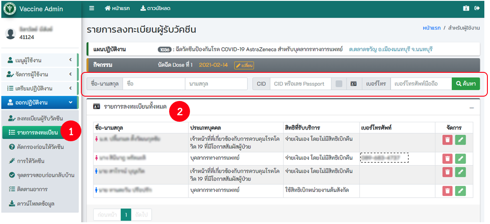
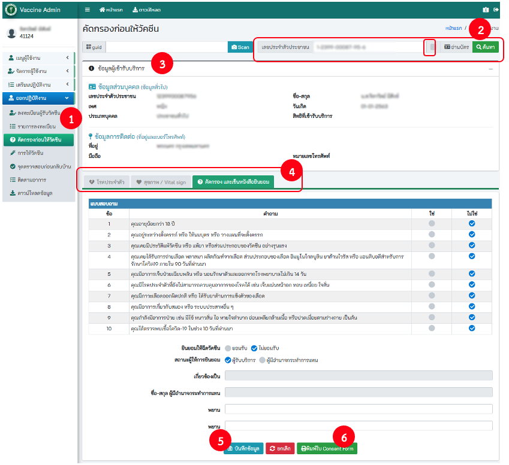
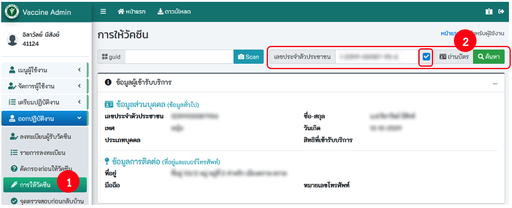
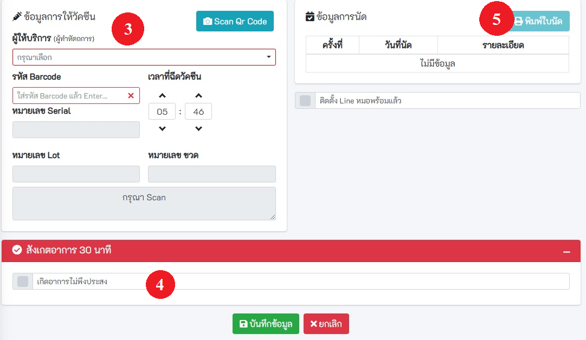
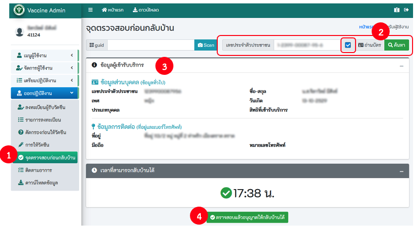

# ออกปฏิบัติงาน

## 4.1 ลงทะเบียนผู้รับวัคซีน
### 4.1.1 การค้นหา

1. คลิกที่ checkbox ตรวจสอบว่ามีสิทธิ์เข้ารับวัคซีนหรือไม่
1. ระบุเงื่อนไขในการค้นหา เช่น เลขบัตรประจำตัวประชาชน ขื่อ นามสกุล หลังจากนั้นกดปุ่ม ค้นหา

### 4.1.2 การใช้เครื่องอ่านบัตรประจำตัวประชาชนแบบ Smartcard
1. คลิกที่ checkbox ใช้เครื่องอ่านบัตร
1. คลิกที่ checkbox ตรวจสอบว่ามีสิทธิ์เข้ารับวัคซีนหรือไม่

1. เสียบบัตรประจำตัวประชาชนแบบ Smartcard เข้ากับเครื่องอ่านบัตร

1. ระบบจะทำการอ่านข้อมูลจากบัตร และเติมลงในช่องต่างๆ
1. เมื่อระบบอ่านข้อมูลสำเร็จจะแสดงไดอะล็อกพร้อมข้อมูล คลิกที่ ปิด [Esc]

1. ระบบจะเติมข้อมูลที่ได้จากบัตร ลงในช่องข้อมูล
1. ระบุข้อมูลให้ถูกต้อง และครบถ้วน โดยเฉพาะช่องสีแดง หลังจากนั้นกดปุ่ม บันทึก

## 4.2 รายการลงทะเบียน

## 4.3 คัดกรองก่อนให้วัคซีน
### 4.3.1 ค้นหา
- ค้นหาโดยกรอกเลขบัตรประจำตัวประชาชน หรือ
- ใช้เครื่องอ่านบัตรประจำตัวประชาชนแบบ Smartcard คลิกที่ checkbox อ่านบัตร

### 4.3.2 พิมพ์ Concense Form

## 4.4 การให้วัคซีน
### 4.4.1 ค้นหา
- ค้นหาโดยกรอกเลขบัตรประจำตัวประชาชน หรือ
- ใช้เครื่องอ่านบัตรประจำตัวประชาชนแบบ Smartcard คลิกที่ checkbox อ่านบัตร

### 4.4.2 กรอกข้อมูล
- ระบุข้อมูลให้ถูกต้อง ครบถ้วน โดยเฉพาะช่องสีแดง หรือ กดปุ่ม Scan QR Code ระบบจะเติมข้อมูลที่ได้จาก QR Code ลงในช่องข้อมูล หลังจากนั้นกดปุ่ม บันทึก

### 4.4.- พิมพ์ใบนัด

## 4.5 จุดตรวจสอบก่อนกลับบ้าน

## 4.6 ติดตามอาการ

- บันทึกติดตามอาการหลังจากได้รับวัคซีน 7 วัน หรือ 30 วัน

