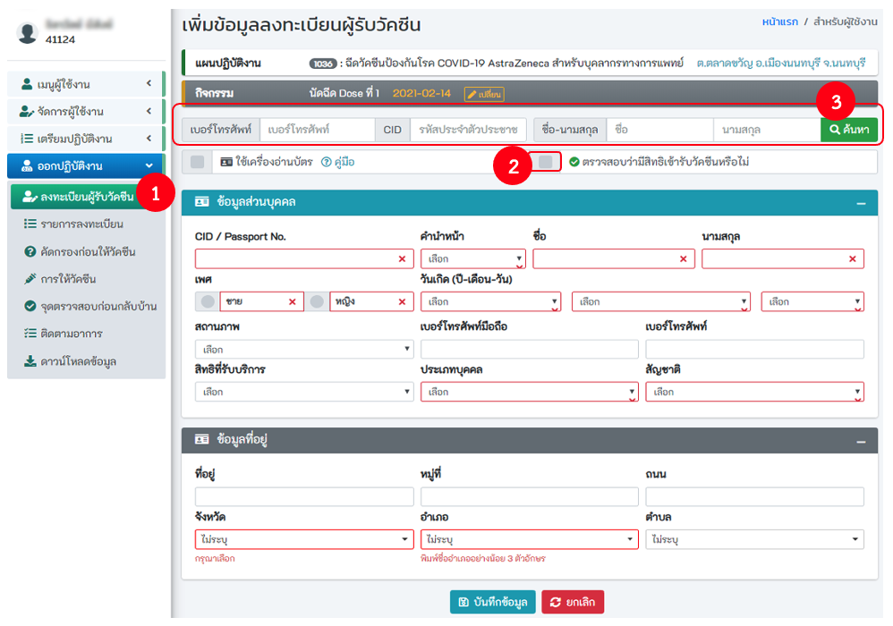
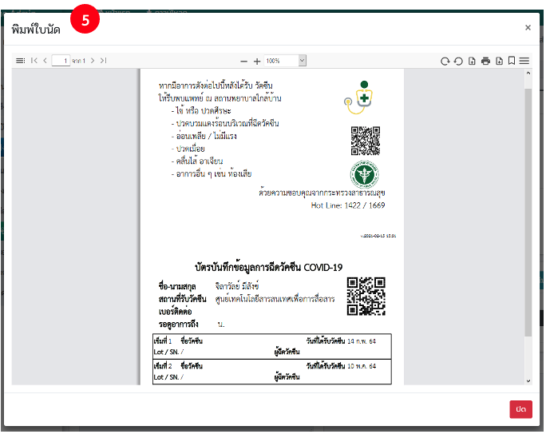
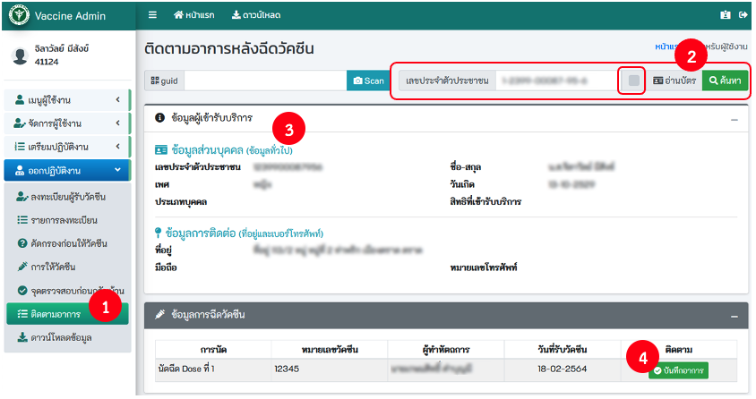
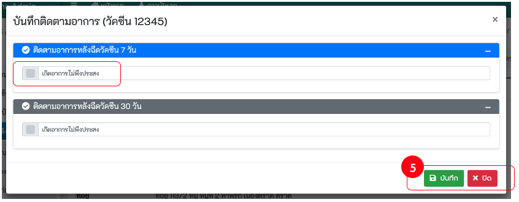

# ออกปฏิบัติงาน

## 6.1 ลงทะเบียนผู้รับวัคซีน
### 6.1.1 การค้นหา
- **การค้นหา** คลิกที่ Checkbox ตรวจสอบว่ามีสิทธิ์เข้ารับวัคซีนหรือไม่ระบุเงื่อนไขในการค้นหา เช่น เลขบัตรประจำตัวประชาชน ขื่อ นามสกุล หลังจากนั้นกดปุ่ม **ค้นหา**

- **การใช้เครื่องอ่านบัตรประจำตัวประชาชนแบบ Smartcard**
  - คลิกที่ checkbox ใช้เครื่องอ่านบัตร
  - คลิกที่ checkbox ตรวจสอบว่ามีสิทธิ์เข้ารับวัคซีนหรือไม่
  
  - เสียบบัตรประจำตัวประชาชนแบบ Smartcard เข้ากับเครื่องอ่านบัตร
  
  - ระบบจะทำการอ่านข้อมูลจากบัตร และเติมลงในช่องต่าง ๆ
  - เมื่อระบบอ่านข้อมูลสำเร็จจะแสดงไดอะล็อกพร้อมข้อมูล คลิกที่ `ปิด [Esc]` 
  
  - ระบบจะเติมข้อมูลที่ได้จากบัตร ลงในช่องข้อมูล
  - ระบุข้อมูลให้ถูกต้อง และครบถ้วน **โดยเฉพาะช่องสีแดง** หลังจากนั้นกดปุ่ม **บันทึก**
  - เมื่อกดปุ่มบันทึก หน้าจอจะแสดงปุ่ม **พิมพ์ใบลงทะเบียน ให้กดปุ่มพิมพ์ใบลงทะเบียน** เพื่อปริ้นใบลงทะเบียนให้กับผู้รับบริการ
  

## 6.2 รายการลงทะเบียน

## 6.3 คัดกรองก่อนให้วัคซีน
### 6.3.1 ค้นหา
- ค้นหาโดยกรอกเลขบัตรประจำตัวประชาชน หรือ
- ใช้เครื่องอ่านบัตรประจำตัวประชาชนแบบ Smartcard  คลิกที่ checkbox อ่านบัตร

- พิมพ์ Concense Form

## 6.4 การให้วัคซีน
### 6.4.1 ค้นหา
- ค้นหาโดยกรอกเลขบัตรประจำตัวประชาชน หรือ
- ใช้เครื่องอ่านบัตรประจำตัวประชาชนแบบ Smartcard คลิกที่ checkbox อ่านบัตร

### 6.4.2 กรอกข้อมูล
- ระบุข้อมูลให้ถูกต้อง ครบถ้วน **โดยเฉพาะช่องสีแดง** หรือ กดปุ่ม Scan QR Code ระบบจะเติมข้อมูลที่ได้จาก QR Code ลงในช่องข้อมูล หลังจากนั้นกดปุ่ม **บันทึก**

### 6.4.3 พิมพ์ใบนัด

## 6.5 จุดตรวจสอบก่อนกลับบ้าน

## 6.6 ติดตามอาการ

- บันทึกติดตามอาการหลังจากได้รับวัคซีน 7 วัน หรือ 30 วัน

## 6.7 ดาวน์โหลดข้อมูล
- เลือกแผนปฏิบัติงาน และเลือกกิจกรรมของงานหรือ คลิกที่ checkbox ทั้งหมด หากต้องดาวน์โหลดข้อมูลผู้ที่ได้รับวัคซีนทั้งหมด

